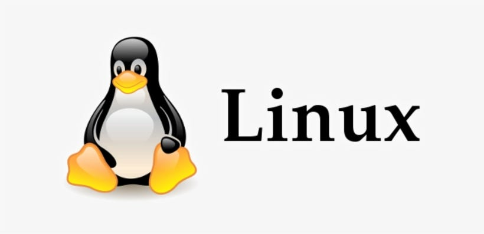

<h1 align="center"> 🐧 Introduction to Linux</h1>

## 🖥️ OPERATING SYSTEM (OS)
An **Operating System (OS)** is a software that manages computer hardware and software resources while providing essential services for computer programs. It acts as an intermediary between users and computer hardware.

### ⚙️ Functions of an Operating System
1. 🧠 **Process Management**: Handles process scheduling, creation, execution, and termination.
2. 🧮 **Memory Management**: Allocates and deallocates memory space efficiently for running programs.
3. 🔌 **I/O Management**: Manages input and output operations, ensuring seamless communication between hardware devices and software applications.

---

### 🧭 Linux Workflow  
**👤 User → 🖳 Shell → 🧠 Kernel → 🧰 Hardware**

- **👤 User**: Interacts with the system through a command-line interface (CLI) or graphical user interface (GUI).
- **🖳 Shell**: Processes user commands and forwards them to the kernel.
- **🧠 Kernel**: Manages system resources and interacts with the hardware.
- **🧰 Hardware**: Executes required operations based on kernel instructions.

---

## 🧓 What is UNIX?
UNIX is a powerful, multiuser, multitasking OS developed in the 1970s by Ken Thompson, Dennis Ritchie, and others at AT&T Laboratories. It serves as the foundation for many modern operating systems, including Linux and macOS.

## 🐧 What is Linux?
Linux is an open-source, UNIX-like operating system based on the Linux kernel. It was created by Linus Torvalds in 1991 and has since become one of the most popular OS choices for servers, desktops, and embedded systems.

---

## 🕰️ History and Evolution of Linux
- **1991**: 🧑‍💻 Linus Torvalds develops the first version of the Linux kernel.
- **1992**: 🧩 Linux adopts GNU utilities, forming a complete OS.
- **1994**: 🐧 Linux Kernel 1.0 is released.
- **2000s**: 💼 Linux expands into enterprise and consumer markets.

---

## 🧠 What is the Linux Kernel?
The Linux kernel is the core of the Linux operating system. It acts as the bridge between software applications and hardware, managing essential functions such as:

- 🧠 **Process Management**: Allocating CPU time to running processes.
- 💾 **Memory Management**: Efficiently managing RAM usage.
- 🖨️ **Device Management**: Controlling hardware components like disks and printers.
- 🔐 **Security and Access Control**: Enforcing system security policies.

---

## 🌟 Linux Features
1. 🆓 **Open Source**: The Linux source code is freely available, allowing developers to modify and distribute it.
2. 🔁 **Multitasking**: Linux supports running multiple processes simultaneously.
3. 👥 **Multiuser**: Multiple users can access the system at the same time.
4. 🔌 **Portable**: Linux can run on various hardware architectures, from personal computers to embedded devices, Linux can Live run.
5. 🔒 **Security**: Features robust security mechanisms, including user permissions, firewalls, and encryption.
6. 🧱 **Reliability**: Known for its stability, uptime, and efficient resource management.
7. 🛠️ **Customizable & Flexible**: Users can modify the system to suit their needs, from the desktop environment to the kernel itself.

---
## 🆓 What is Open Source?
Open-source software allows users to freely access, modify, and distribute its source code. Some open-source software is free, while others offer paid versions with additional support and enterprise features.

## 📦 Linux Distributions

Linux distributions (distros) are versions of Linux that package the kernel with various software components.

| 🏷️ Distribution Family | 📁 Package Format | 🔧 Package Manager | 🌍 Popular Distros |
|------------------------|------------------|--------------------|--------------------|
| Debian                 | `.deb`           | `dpkg`, `apt`      | Ubuntu, Kali Linux, Debian |
| Red Hat                | `.rpm`           | `rpm`, `yum`       | Fedora, CentOS     |
| Arch Linux             | `.tar.zst`       | `pacman`           | Arch Linux, Manjaro|
| Slackware              | `.tgz`           | `pkgtool`, `slackpkg` | Slackware         |
| SUSE                   | `.rpm`           | `zypper`           | openSUSE, SUSE Linux Enterprise |
| Gentoo                 | Source-based     | `emerge`           | Gentoo Linux       |

---

## 📌 Key Concepts

### 🧱 What is Linux?
- Kernel-based operating system.
- Originally developed by Linus Torvalds in 1991.
- Open-source and community-driven.

### 🧩 Components of Linux
- **🧠 Kernel** – Core of the OS, manages hardware.
- **🖳 Shell** – Interface between user and system (e.g., Bash).
- **📁 File System** – Organized in a hierarchy (starts with `/`).
- **🛠️ Utilities** – Tools and commands for various tasks.

---

## ⚙️ Common Linux Commands

| 💻 Command    | 📋 Description                          |
|--------------|------------------------------------------|
| `ls`         | List directory contents                  |
| `cd`         | Change directory                         |
| `pwd`        | Print working directory                  |
| `mkdir`      | Create a new directory                   |
| `touch`      | Create an empty file                     |
| `rm`         | Delete files or directories              |
| `cp`         | Copy files or directories                |
| `mv`         | Move or rename files or directories      |
| `man`        | Display manual for a command             |

---

## 🚀 Why Learn Linux?

- 💼 In-demand skill in tech industries.  
- 🧩 Power and flexibility for development and administration.  
- 🤝 Strong support from open-source communities.

---
