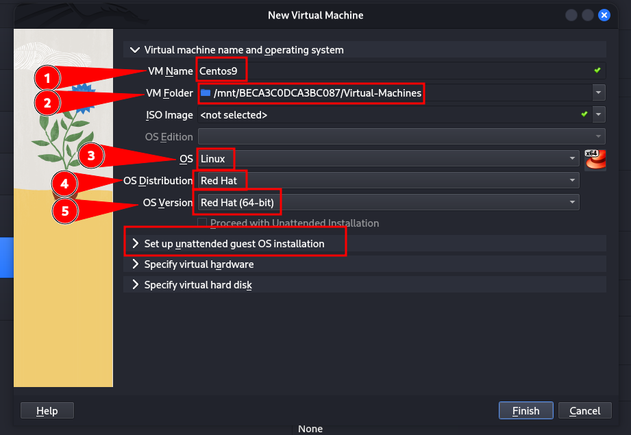
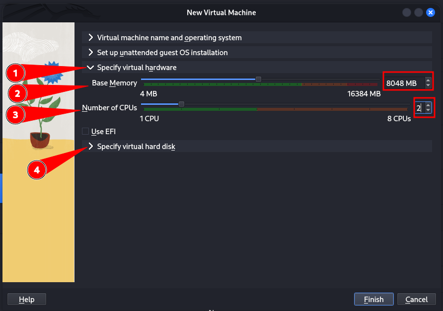
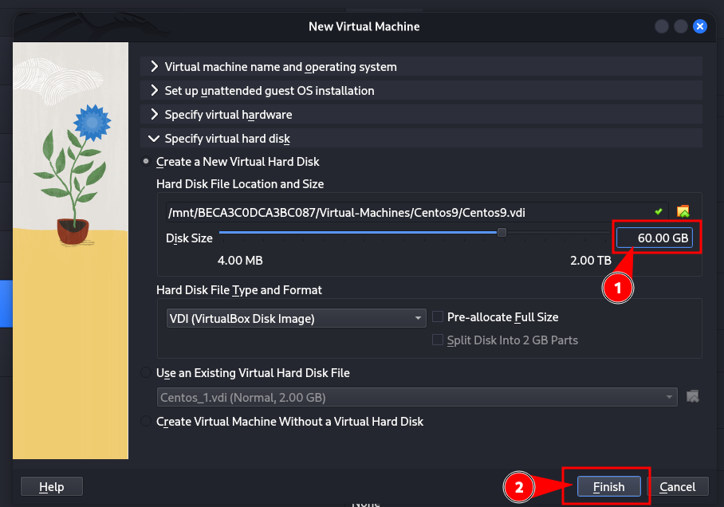
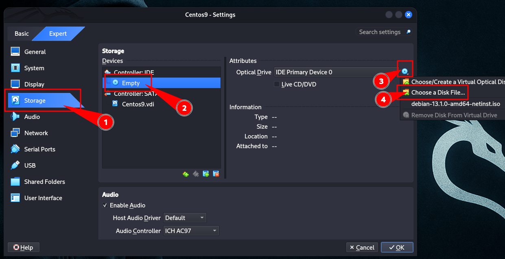
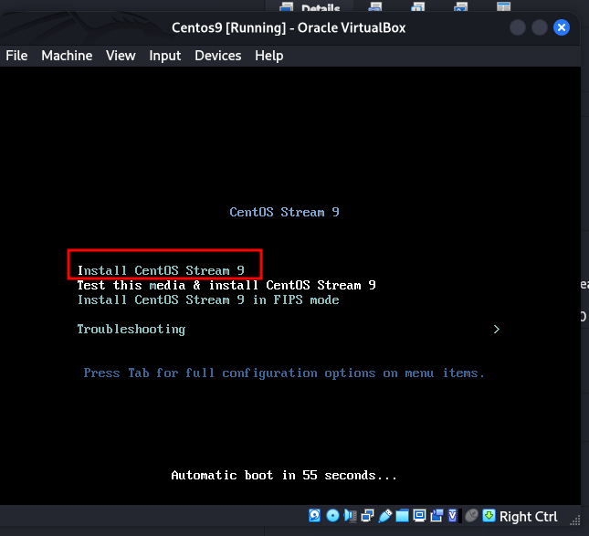
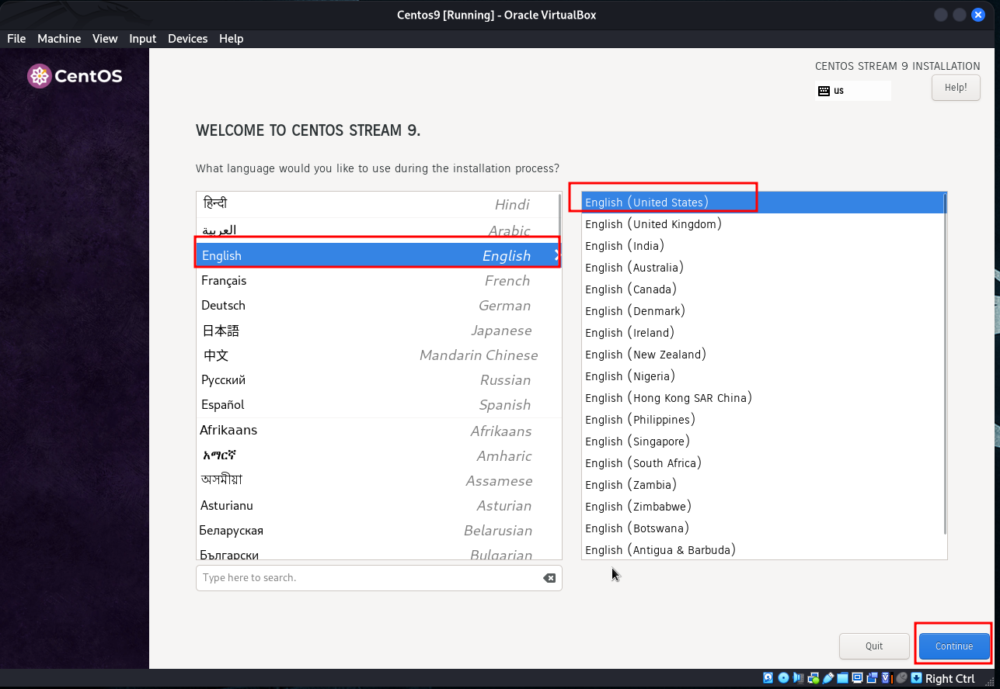
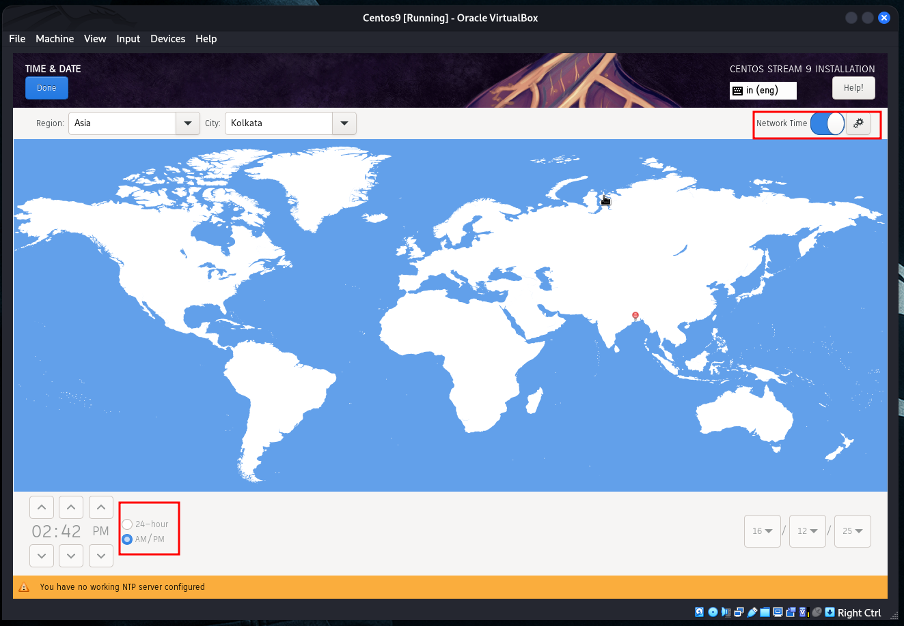

# 🐧 Install **CentOS** on a **Virtual Machine**

### 📦 Step-by-Step Guide


---

## 📌 Requirements (Before You Start)

✅ Computer/Laptop
✅ Internet Connection 🌐
✅ Virtualization enabled in BIOS ⚙️
✅ Virtual Machine Software
✅ CentOS ISO file

---

## 🔹 Step 1: Download CentOS ISO 📥

👉 Official website:
🔗 [https://www.centos.org/download/](https://www.centos.org/download/)

Recommended:

* **CentOS Stream DVD ISO**
* File extension: `.iso`

📌 Example:

```
CentOS-Stream-9-latest-x86_64-dvd1.iso
```

---

## 🔹 Step 2: Install Virtual Machine Software 💻

You can use **VirtualBox** (Free & Popular)

👉 Download VirtualBox:
🔗 [https://www.virtualbox.org/wiki/Downloads](https://www.virtualbox.org/wiki/Downloads)

Also install:
👉 VirtualBox Extension Pack
🔗 [https://www.virtualbox.org/wiki/Downloads](https://www.virtualbox.org/wiki/Downloads)

---

## 🔹 Step 3: Create New Virtual Machine 🆕

1. Open **VirtualBox**
2. Click **New**


📝 Fill details:

* **Name:** CentOS
* **Type:** Linux
* **Version:** Red Hat (64-bit)

 
---

### 🧠 Allocate Memory (RAM)

* Minimum: **2 GB (2048 MB)**
* Recommended: **4 GB**

---

### 💽 Create Virtual Hard Disk

* Select **Create a virtual hard disk now**
* Type: **VDI**
* Storage: **Dynamically allocated**
* Size: **20–40 GB**

✅ Click **Create**

---

## 🔹 Step 4: Attach CentOS ISO 📀

1. Select VM → **Settings**
2. Go to **Storage**
3. Under *Controller IDE* → Empty
4. Click CD icon → **Choose a disk file**
5. Select **CentOS ISO**

✅ Click **OK**

---

## 🔹 Step 5: Start Virtual Machine ▶️

Click **Start** 🚀
CentOS boot menu will appear

Choose:

```
Install CentOS Stream
```

Press **Enter**

---

## 🔹 Step 6: CentOS Installation 🛠️




### 🌐 Select Language

* English → Continue


---

### ⏰ Date & Time

* Select Region: **Asia**
* City: **Kolkata**
* Enable **NTP**

---

### ⌨️ Keyboard

* English (US)

---

### 💽 Installation Destination

* Select Virtual Disk
* Choose **Automatic Partitioning**
* Click **Done**

---

### 🌐 Network Configuration

* Turn **ON** Ethernet
* Hostname (optional):

  ```
  centos-server
  ```

---

### 👤 User Settings

* **Set Root Password** 🔐
* **Create User** (Recommended)

  * Check: *Make this user administrator*

---

## 🔹 Step 7: Begin Installation 🚀

Click **Begin Installation**

⏳ Wait 5–10 minutes…

---

## 🔹 Step 8: Reboot System 🔄

After installation completes:

* Click **Reboot System**
* Remove ISO if prompted

---

## 🔹 Step 9: Login to CentOS 🎉

Login using:

* Username
* Password

You are now inside **CentOS Linux** 🐧✅

---

## 🧪 Post-Installation Commands (Optional)

### 🔍 Check OS Version

```bash
cat /etc/os-release
```

---

### 🌐 Check Network

```bash
ip a
ping google.com
```

---

### 📦 Update System

```bash
sudo dnf update -y
```

---

### 🖥️ Install Basic Tools

```bash
sudo dnf install vim wget curl net-tools -y
```

---

## 📌 Useful Hyperlinks 🔗

* 🌍 CentOS:
  [https://www.centos.org/](https://www.centos.org/)
* 💻 VirtualBox:
  [https://www.virtualbox.org/](https://www.virtualbox.org/)
* 📘 CentOS Docs:
  [https://docs.centos.org/](https://docs.centos.org/)
* 🐧 Linux Commands:
  [https://linux.die.net/man/](https://linux.die.net/man/)

---

## 📝 Exam / Interview Notes ⭐

* CentOS uses **Anaconda Installer**
* Package Manager: **DNF**
* Configuration files → `/etc`
* Logs → `/var/log`
* Kernel → `/boot`

---

If you want, I can also:

* 📄 Convert this to **PDF**
* 🧠 Add **MCQs for exams**
* 🖥️ Explain **CentOS networking setup**
* 🔐 Configure **SSH, Apache, PHP**

Just tell me 👍😊
