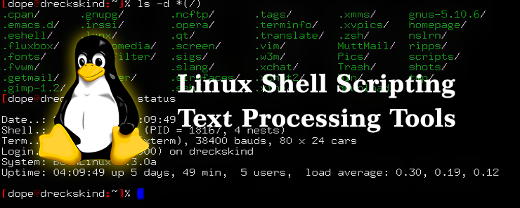

# Linux Text Processing & Shell Utilities Guide

This repository contains a comprehensive collection of Linux command guides focused on text processing, file handling, shell utilities, and environment management.

## 📁 Documentation Index

- [001 - String Processing](001-String%20Processing.md)
- [002 - head](002-head.md)
- [003 - tail](003-tail.md)
- [004 - wc](004-wc.md)
- [005 - sort](005-sort.md)
- [006 - Duplicates & watch](006-duplicates_and_watch.md)
- [007 - grep (Basics)](007-grep_command.md)
- [008 - grep (Advanced)](008-grep.md)
- [009 - Character Classes](009-Character_clasess.md)
- [010 - cut & paste Commands](010-cut_Paste_command.md)
- [011 - AWK Command](011-AWK_Command.md)
- [012 - AWK Structure](012-awk_Structure.md)
- [013 - Searching Patterns](013-Seaching_of_the_Pattern.md)
- [014 - Sed Stream Editor](014-Sed.md)
- [015 - find Command](015-Find.md)
- [016 - tree Command](016-Tree.md)
- [017 - locate Command](017-locate.md)
- [018 - Environment Variables in Linux](018-Environment-Variable-in-linux.md)
- [019 - Shell in Linux](019-Shell-in-Linux.md)

## 🚀 Purpose
This collection serves as a practical reference for beginners and intermediate Linux users to understand, use, and master powerful text manipulation and shell utilities.

## 📌 Notes
- Examples included in each file for easy learning.
- Focused on real-world command-line usage.
- Suitable for interview preparation and DevOps fundamentals.

---