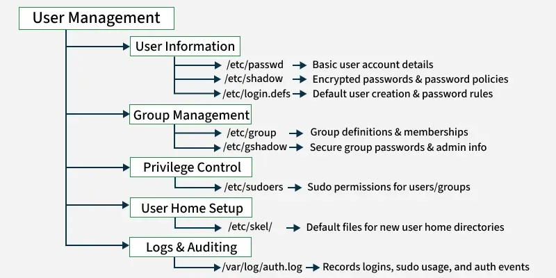

# 👤 User and Group Management in Linux



Linux is a multi-user operating system. Managing users and groups is fundamental for securing and organizing access to system resources.

---

## 📌 Users

A **user account** in Linux defines who can log into the system and what they can access or do.

---

## 📌 Components of a User Account

| Component     | Description |
|---------------|-------------|
| **Username**  | Unique name identifying the user (e.g., `karan`, `admin`) |
| **UID**       | User ID – numerical value identifying the user  |
| **GID**       | Primary group ID the user belongs to |
| **Home Directory** | Default location for user files (e.g., `/home/sachin`) |
| **Shell**     | The command-line interface assigned (e.g., `/bin/bash`) |
| **Password**  | Encrypted and stored in `/etc/shadow` |
| **System Files** | `/etc/passwd`, `/etc/shadow`, `/etc/login.defs` |

## UID(User ID),GID (Group ID)

- `0` : root user
```bash
root:x:0:0:root:/root:/bin/bash
```
- `1–999` : system users (varies by distro) 
 ```bash
daemon:x:2:2:daemon:/sbin:/sbin/nologin
```
- `1000+` : regular users
 ```bash
u26:x:1030:1030:Full user details:/backup/u26:/usr/bin/bash
```
---

## 📌 System Files

| File              | Purpose |
|-------------------|---------|
| **/etc/passwd**   | Stores basic user information (username, UID, GID, home dir, shell) |
| **/etc/shadow**   | Stores encrypted passwords and password aging data |
| **/etc/group**    | Stores group information including GIDs and members |
| **/etc/gshadow**  | Secure group file for administrative group privileges |
| **/etc/login.defs** | Default configuration for new user accounts |

---
## 📌 Types of User Accounts

- **System Accounts**: Created for system services (e.g., `nobody`, `daemon`).
- **Regular User Accounts**: Created for human users to log in and use the system.
- **Service Accounts**: Created for applications or daemons, often with restricted permissions.

---

## 📌 What is a Daemon in Linux?

A **daemon** is a background process that runs continuously and performs system-level tasks or services **without user interaction**.

---

## 📌 Characteristics of Daemons

- Run silently in the background  
- Start automatically at boot (via **init** or **systemd**)  
- Usually do **not** have a terminal (no TTY)  
- Names often end with the letter **d** (e.g., `sshd`, `cron`, `systemd`)  

---

## 📌 The `daemon` User and Group

Linux systems include a special **`daemon` user and group**, used for running background services with **limited privileges**.

### Purpose
- Isolate system services from each other and from regular users  
- Minimize damage in case of compromise (**principle of least privilege**)  

---
## 📌 Common Attributes of the `daemon` User

| Attribute       | Value |
|-----------------|-------|
| **Username**    | `daemon` |
| **UID**         | Usually `1` (varies by distribution) |
| **Group**       | `daemon` |
| **GID**         | Usually `1` |
| **Home Directory** | `/usr/sbin` or `/nonexistent` |
| **Shell**       | `/usr/sbin/nologin` or `/bin/false` |

> 🔒 The `daemon` user typically cannot log in interactively. It exists only to run background services safely.

---

## 📌 View the `daemon` Account

```bash
getent passwd daemon
```
Example output:
```bash
daemon:x:1:1:daemon:/usr/sbin:/usr/sbin/nologin
```
## 📌 View the daemon Group
```bash
getent group daemon
```
Example output:
```bash
daemon:x:1:
```
---
## 📌 Example Use Case

Some legacy or minor services may be configured to run as the **daemon** user:

```bash
ps -u daemon
```
- However, most modern services use **dedicated service accounts** for better isolation,
for example:`www-data`,`nginx`,`sshd`,`mysql`
---

## 📌 User Management Commands

### ➕ Add a New User
```bash
useradd username
```

### ➕ Add a User with Home Directory and Default Shell
```bash
useradd -m -s /bin/bash username
```

### 🔑 Set Password for the User
```bash
passwd username
```

### ✏️ Modify a User (e.g., Change Login Name)
```bash
usermod -l newname oldname
```

### ❌ Delete a User
```bash
userdel username
```

### ❌ Delete a User and Remove Their Home Directory
```bash
userdel -r username
```

### 🔒 Lock or Unlock a User Account
```bash
passwd -l username     # Lock account
passwd -u username     # Unlock account
```
---
# 👥 Groups in Linux

A **group** is a logical collection of users who share common access privileges.  
Linux permissions can be applied to groups instead of individual users.

---

## 📌 Group Components

| Component      | Description |
|----------------|-------------|
| **Group Name** | Human-readable identifier (e.g., `sudo`, `staff`) |
| **GID**        | Group ID – numerical identifier |
| **Members**    | Users assigned to the group |

---

## 📌 Group Types

- **Primary Group**: Assigned at user creation; all files created belong to this group.  
- **Supplementary Groups**: Additional groups providing broader access.  

---

## 📌 Common System Groups

| Group         | Purpose |
|---------------|---------|
| **wheel / sudo** | Users allowed to run commands as root |
| **adm, sys**     | System-level monitoring or administrative tasks |
| **www-data**     | Web server processes (e.g., Apache, Nginx) |
| **docker**       | Users with permission to manage Docker without `sudo` |

---
# 🛠️ Group Management Commands

### ➕ Create a Group
```bash
groupadd groupname
```

### ❌ Delete a Group
```bash
groupdel groupname
```

### ➕ Add User to Supplementary Group
```bash
usermod -aG groupname username
```

### ❌ Remove User from Group (Debian/Ubuntu with gpasswd)
```bash
gpasswd -d username groupname
```

### 🔄 Change User’s Primary Group
```bash
usermod -g groupname username
```

### 👥 View Groups of a User
```bash
groups username
```

### 👤 Show Group Membership for Current User
```bash
id
```
---
# ⚙️ View Default User Configuration

View login defaults used by `useradd` and other tools:
```bash
cat /etc/login.defs
```

Clean output (without comments or blank lines):
```bash
grep -v "^#" /etc/login.defs | grep -v "^$"
```

---

# 🔐 Password and Security Settings

Linux enforces password and account policies via:  
- `/etc/login.defs`  
- `/etc/shadow`  
- PAM (Pluggable Authentication Modules)  

---

## 📌 Password Aging Example

```bash
chage -l username      # Show password aging info
chage -M 90 username   # Set max days before password must change
```
---

# ✅ Summary

| Task          | Command |
|---------------|---------|
| **Add user**  | `useradd`, `adduser` |
| **Delete user** | `userdel` |
| **Modify user** | `usermod` |
| **Add group**  | `groupadd` |
| **Delete group** | `groupdel` |
| **Modify group** | `groupmod`, `gpasswd` |
| **View account info** | `id`, `getent`, `cat /etc/passwd` |
| **Check defaults** | `cat /etc/login.defs` |

---


## Editing and Checking `/etc/login.defs`

### Open the file with `vim`
```bash
vim /etc/login.defs
```
### View only active configurations (ignoring comments and empty lines)

```bash
grep -v "#" /etc/login.defs | grep -v "^$"
```

Explanation:
`grep -v "#"` → removes commented lines.

`grep -v "^$"` → removes blank/empty lines.

Together, this shows only the effective configuration values in `login.defs`.


