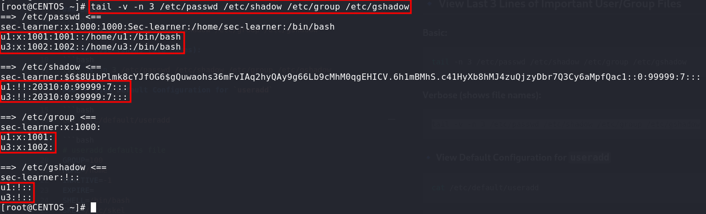
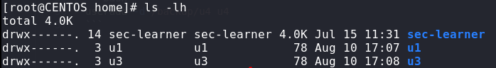

# Useradd and adduser

## 🔹 View Last 3 Lines of Important User/Group Files

### Basic:
```bash
tail -n 3 /etc/passwd /etc/shadow /etc/group /etc/gshadow
```
### Verbose (shows file names):
```bash
tail -v -n 3 /etc/passwd /etc/shadow /etc/group /etc/gshadow
```
### 🔹 View Default Configuration for `useradd`

```bash
cat /etc/default/useradd
```
```bash
# useradd defaults file
GROUP=100
HOME=/home
INACTIVE=-1
EXPIRE=
SHELL=/bin/bash
SKEL=/etc/skel
CREATE_MAIL_SPOOL=yes
```

--- 
### 🔹 Get Help for Commands
useradd and adduser help:

```bash
useradd --help ,adduser --help
```
## 🔹 Creating Users
#### Create user u1 without a home directory:
```bash
useradd u1
```
```bash
useradd u3
```


```bash
cd /home/
```


## 1st> Create user u4 with a custom home directory (/backup/u4):

Now we are creating a new user and the home directory is in another location. Follow these steps:

#### 1> Create a directory on `/` :

```bash
mkdir /backup
```
#### 2> Edit `/etc/default/useradd`:

```bash
vim /etc/default/useradd
```

#### Default code:
```bash
# useradd defaults file
GROUP=100
HOME=/home
INACTIVE=-1
EXPIRE=
SHELL=/bin/bash
SKEL=/etc/skel
CREATE_MAIL_SPOOL=yes
```
#### Modify based on our requirements:

```bash
# useradd defaults file
GROUP=100
#HOME=/home
HOME=/backup
INACTIVE=-1
EXPIRE=
#SHELL=/bin/bash
SHELL=/bin/bash
SKEL=/etc/skel
CREATE_MAIL_SPOOL=yes
```
#### Add user `u5`:

```bash
useradd u5
```
#### Check changes:
```bash
tail -v -n 3 /etc/passwd /etc/shadow /etc/group /etc/gshadow
==> /etc/passwd <==
u3:x:1002:1002::/home/u3:/bin/bash
u4:x:1003:1003::/home/u4:/bin/bash
u5:x:1004:1004::/backup/u5:/bin/bash

==> /etc/shadow <==
u3:!!:20310:0:99999:7:::
u4:!!:20310:0:99999:7:::
u5:!!:20310:0:99999:7:::

==> /etc/group <==
u3:x:1002:
u4:x:1003:
u5:x:1004:

==> /etc/gshadow <==
u3:!::
u4:!::
u5:!::
```

## Check backup file create location:
```bash
ls -lh /backup

drwx------. 3 u5 u5 78 Aug 10 17:32 u5

```
## 2nd> No changes in default file `/etc/default/useradd` then:

#### Create user u7 with a `/backup` directory:
```bash
useradd u7 -d /backup/u7
```
#### Check passwd file user u7 directory:

```bash
tail -v -n 3 /etc/passwd /etc/shadow /etc/group /etc/gshadow
```

### create use u8 :
✅ What It Does:
`useradd` → Command to add a new user.

`u8` → The username being created.

`-m` → Creates the user’s home directory if it does not exist.

`-d /backup/u8` → Sets /backup/u8 as the user’s custom home directory.

```bash
useradd u8 -m -d /backup/u8
```

#### Creates user u9 without creating a home directory.
```bash
useradd --no-create-home u9
```
#### Same as above: adds user u10 but does not create a home directory.
```bash
useradd -M u10
```
#### Creates user u11 with the comment (description) "Admin User".
```bash
useradd -c "Admin User" u11
```
#### Creates user u12 with the comment "Test User".
```bash
useradd --comment "Test User" u12
```
The `-c` and `--comment` options add a description to the user’s account, often visible in `/etc/passwd`.

--- 

### Creates user u13 without creating a new group with the same name.
```bash
useradd --no-user-group u13
```

#### 
```bash
tail -v -n 3 /etc/passwd /etc/shadow /etc/group /etc/gshadow
```

#### Same as above: creates user u14 without a new group.
```bash
useradd -N u14
```

#### Creates user u15 with `/usr/bin/fish` as the login shell.
```bash
useradd --shell /usr/bin/fish u15
```

#### Creates user `u16` with `/bin/sh` as the login shell.
```bash
useradd -s /bin/sh u16
```

#### Creates user `u17` with user ID (UID) set to `1020`.
```bash
useradd -u 1020 u17
```
#### Creates user `u18` with `/bin/sh` as the login shell.
```bash
useradd -s /bin/sh u18
```
#### Also, this command shows the last 3 lines of key system files with filenames shown:
```bash
tail -v -n 3 /etc/passwd /etc/shadow /etc/group /etc/gshadow

==> /etc/passwd <==
u16:x:1014:1014::/home/u16:/bin/sh
u17:x:1020:1020::/home/u17:/bin/bash
u18:x:1021:1021::/home/u18:/bin/sh
```
--- 
## 🧑‍💻 Root User & UID Customization
#### Create Users with UID 0 (Root Access — ⚠ Dangerous)

```bash
useradd -u 0 admin
```
- Creates a user named admin with UID 0 (root privileges).

```bash
useradd -o -u 0 admin
```
- Same as above but allows duplicate `UIDs` with `-o` (non-unique).

```bash
useradd --non-unique --uid 0 admin2
```
- Alternative syntax to create another root-level user `admin2`.

#### 🔍 Verify changes:
```bash
tail -v -n 3 /etc/passwd /etc/shadow /etc/group /etc/gshadow
```

--- 

## 👥 Group Assignment

```bash
useradd -g 1010 u19
```
- Adds user u19 to group with GID 1010.

```bash
useradd -g 1015 u20
```
- Adds user u20 to group with GID 1015.

---
## 🔐 Password Assignment (⚠ Not Recommended)
```bash
useradd -p 123 u21
```
- Adds user `u21` with password hash `123`.

⚠ `-p `requires a `pre-encrypted` password — using plaintext like `123` is insecure and often ineffective.

## 🔍 Check /etc/shadow:
```bash
tail -v -n 3 /etc/shadow

==> /etc/shadow <==
admin2:!!:20310:0:99999:7:::
u19:!!:20310:0:99999:7:::
u21:123:20310:0:99999:7:::
```
- `!!` → No password set.

- `123` → Appears to be stored as-is (not encrypted) — not valid for login.

---
