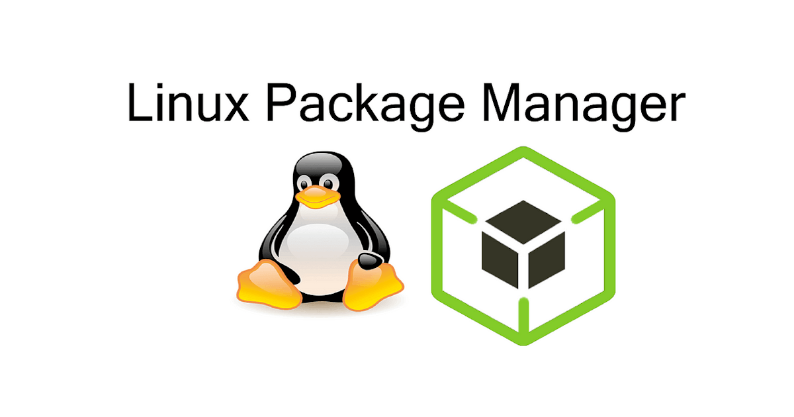

# 📦 Linux Package Management Documentation

A concise and easy-to-follow collection of guides covering essential Linux package management concepts and tools.

## 📁 Contents

- [01 — Package Management in Linux](01-Package-Managment-in-linux.md)
- [02 — Red Hat Package Manager (RPM)](02-Red-hat-package-manager.md)

## 🧠 What You'll Learn
- How package management works across Linux distributions.
- Installing, updating, querying, and removing software packages.
- RPM usage for Red Hat–based systems.

## 🔧 Notes
- Commands included are tested on common Linux distros.
- Great for beginners, Linux learners, SysAdmins, and DevOps engineers.

---
**Maintainer:** Gourav Kushwah