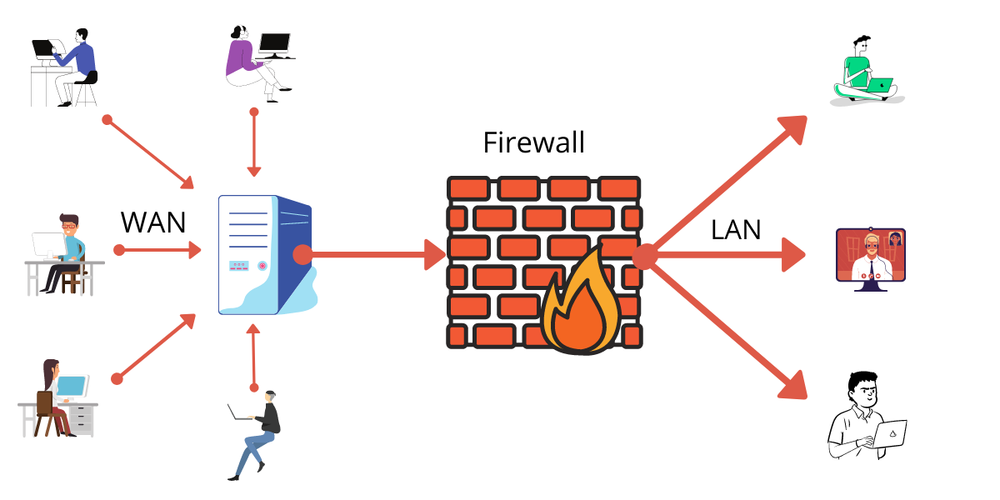

# 🔐 Linux Security, Firewall & System Utilities Guide

This repository provides comprehensive documentation on Linux security tools, firewalls, scheduling systems, monitoring utilities, and system automation.

## 📁 Documentation Index

### 🔥 Firewall & Security
- [001 — Firewall: Network Security Barrier](001-Firewall%20-%20Network%20Security%20Barrier.md)
- [002 — Network Operating System & Security Solutions](002-Network-Operating-System-and_Security-Solutions.md)
- [003 — IPTables Configurations & Management](003-IPTables-Configurations-and-Management.md)
- [004 — Firewalld](004-Firewalld.md)
- [005 — Uncomplicated Firewall (UFW)](005-Uncomplicated-firewall(UFW).md)
- [006 — ClamAV Antivirus](006-Clamav-Antivirus.md)

### ⏱️ Scheduling & Automation
- [007 — Cron Job in Linux](007-Crown-Job-in-linux.md)
- [008 — Cron Timing Syntax](008-Cron-Timing-Syntax.md)
- [011 — System Timer in Linux (systemd timers)](011-System-Timer-in-Linux.md)
- [012 — Running Custom Scripts on Shutdown, Boot, Login & Logout (systemd)](012-Running-Custom-Script-on-Shutdown-boot-login-and-logout-with-systemd.md)

### 🛠️ Monitoring & Utilities
- [009 — Screen Command](009-Screen-Command.md)
- [010 — TCP Dump Command](010-TCP-Dump-command.md)

## 🚀 Purpose
This repository helps you understand and manage:
- Firewall systems (IPTables, UFW, Firewalld)
- Linux security enhancements
- Antivirus scanning using ClamAV
- Cron jobs and systemd automation
- Terminal multiplexing with screen
- Packet capturing with tcpdump
- System timers for automation

## 📌 Notes
- All commands tested on standard Linux distributions.
- Guides focus on practical, real-world usage.
- Suitable for SysAdmins, DevOps engineers, and cybersecurity learners.

---

