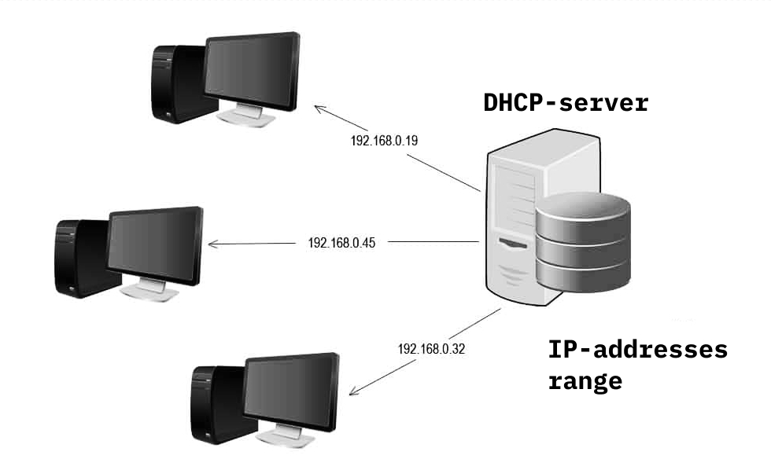

# 📡 DHCP Server Configuration Guide

This repository contains structured and practical documentation for configuring and managing DHCP (Dynamic Host Configuration Protocol) services on Linux systems.

## 📁 Documentation Index

- [01 — DHCP Server Setup](01-DHCP-Server.md)
- [02 — Configure DHCP Exclusion Range](02-Configure-DHCP-Exclusion-Range.md)
- [03 — Reserve IP Address](03-Reserve-IP-Address.md)
- [04 — Whitelist / Allow List Clients in DHCP](04-White-or-Allow-list%20Clients%20in%20DHCP.md)
- [05 — Blacklist / Deny List Clients in DHCP](05-Black-or-Deny-list%20Clients%20in%20DHCP.md)
- [06 — Allow for Known & Unknown Clients](06-Allow-for-known-and-UnKnown.md)

## 🚀 Purpose
These guides help you understand how to:
- Configure a DHCP server from scratch
- Manage IP ranges and exclusions
- Reserve static IP addresses dynamically
- Control network access using white/blacklisting
- Handle known and unknown clients effectively

## 📌 Notes
- Examples are based on standard Linux DHCP server configurations.
- Suitable for SysAdmins, Network Engineers, and DevOps learners.

---
