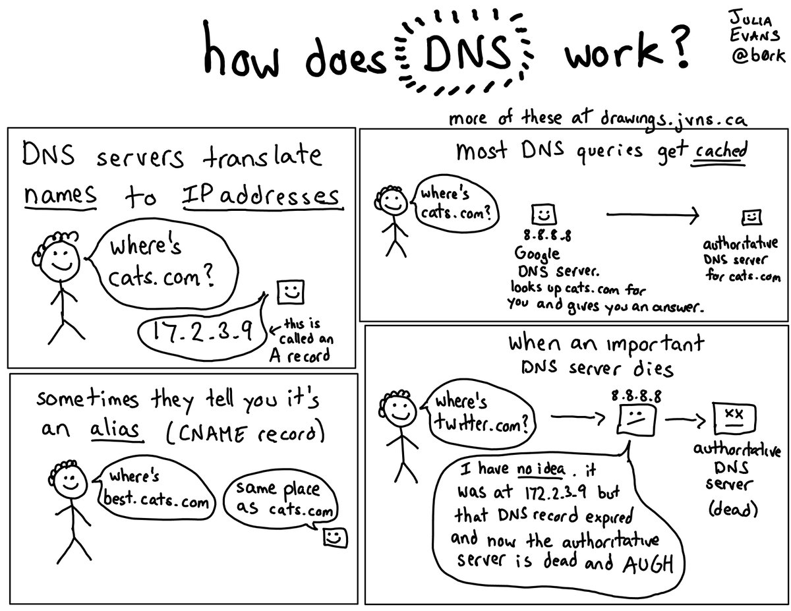

# 🌐 DNS Client Tools Guide

This repository contains documentation on essential DNS client utilities used for querying and troubleshooting domain name system records.

## 📁 Documentation Index

- [001 — DNS Client Tool Overview](001-DNS-Client-Tool.md)
- [002 — dig Command](002-Dig.md)
- [003 — host Command](003-host.md)
- [004 — nslookup Command](003-nslookup.md)

## 🚀 Purpose
These guides help you understand and use:
- Standard DNS lookup tools
- Querying A, AAAA, MX, CNAME, NS and other record types
- Troubleshooting DNS resolution issues
- Comparing different DNS querying utilities

## 📌 Notes
- Commands tested on Linux-based systems.
- Each tool includes examples for quick reference.
- Useful for SysAdmins, DevOps learners, and network engineers.

---
