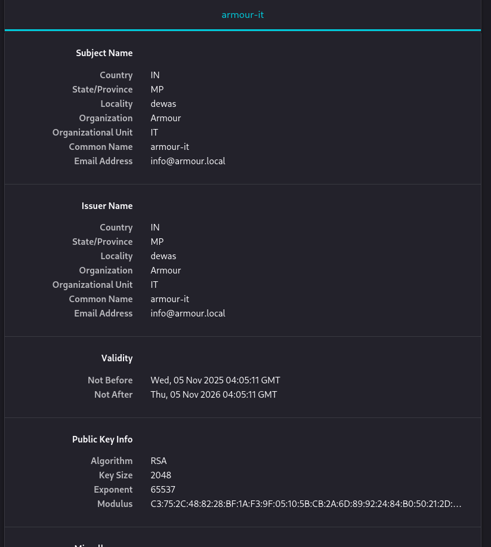
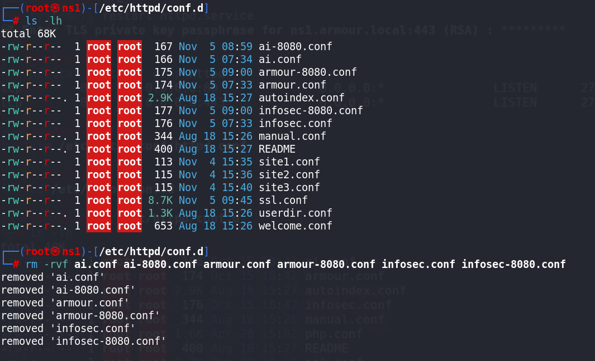

# 🔐 Binding-with-Type (SSL-TLS)

## Step 1: ⚙️ Install and Configure SSL/TLS in Apache

### 🧩 Install mod_ssl
- `mod_ssl` is an Apache module that provides SSL and TLS support.

```bash
💻 yum install mod_ssl
````

---

## Step 2: ✅ Verify mod_ssl Installation

Check if the module is installed:

```bash
rpm -qi mod_ssl
rpm -ql mod_ssl
rpm -qc mod_ssl
rpm -qd mod_ssl
```

---

## 🛠️ Step 3: Configure SSL in Apache

Edit the SSL configuration file:

```bash
vim /etc/httpd/conf.d/ssl.conf
```

Make sure that SSL is enabled by setting appropriate certificate files:

```bash
SSLCertificateFile /etc/pki/tls/certs/localhost.crt
SSLCertificateKeyFile /etc/pki/tls/private/localhost.key
```

---
## Step 4: Restart Apache to Apply SSL Configuration

- Restart Apache to apply SSL configuration:

```bash
systemctl restart httpd.service
```

```bash
ls -lh /etc/pki/tls/certs/localhost.crt
```
```bash
ls -lh /etc/pki/tls/private/localhost.key
```

## Step 5: Verify Apache Listening on SSL Port

Check if Apache is listening on port 443 (SSL):

```bash
netstat -nltup | grep httpd
```

## Step 6: Update Firewall for SSL

Edit the firewall rules to allow SSL traffic (port 443):

```bash
firewall-cmd --permanent --add-port=443/tcp
firewall-cmd --permanent --add-port=8080/tcp
firewall-cmd --reload
```
---

# 2. Create Self-Signed SSL Certificates

## Step 1: Create SSL Directory
Create a directory to store SSL certificates:
```bash
mkdir /opt/ssl
```
```bash
cd /opt/ssl
````

## Step 2: Generate SSL Certificate and Key

Generate a self-signed SSL certificate and key:

```bash
openssl req -x509 -newkey rsa:2048 -keyout key.pem -out cert.pem -days 365
```

## Step 3: Check the Generated Files

Verify the files:

```bash
ls -lh
```
```bash
file key.pem
```
```bash
file cert.pem
```

## Step 4: Copy SSL Files to Appropriate Directories

Copy the certificate and key to the proper directories:

```bash
cp -v /opt/ssl/cert.pem /etc/pki/tls/certs/cert.pem
```
```bash
cp -v /opt/ssl/key.pem /etc/pki/tls/private/key.pem
```
---
## Step 5: Update Apache Configuration with SSL Certificates
- Edit the Apache Configuraion to point to the newly created certificates:
```bash
vim /etc/httpd/conf.d/ssl.conf
```
Add these lines to enable SSL:

```bash
#   SSL Cipher Suite:
#   List the ciphers that the client is permitted to negotiate.
#   See the mod_ssl documentation for a complete list.
#   The OpenSSL system profile is configured by default.  See
#   update-crypto-policies(8) for more details.
SSLCipherSuite PROFILE=SYSTEM
SSLProxyCipherSuite PROFILE=SYSTEM

#   Point SSLCertificateFile at a PEM encoded certificate.  If
#   the certificate is encrypted, then you will be prompted for a
#   pass phrase.  Note that restarting httpd will prompt again.  Keep
#   in mind that if you have both an RSA and a DSA certificate you
#   can configure both in parallel (to also allow the use of DSA
#   ciphers, etc.)
#   Some ECC cipher suites (http://www.ietf.org/rfc/rfc4492.txt)
#   require an ECC certificate which can also be configured in
#   parallel.
#SSLCertificateFile /etc/pki/tls/certs/localhost.crt
SSLCertificateFile /etc/pki/tls/certs/cert.pem

#   Server Private Key:
#   If the key is not combined with the certificate, use this
#   directive to point at the key file.  Keep in mind that if
#   you've both a RSA and a DSA private key you can configure
#   both in parallel (to also allow the use of DSA ciphers, etc.)
#   ECC keys, when in use, can also be configured in parallel
#SSLCertificateKeyFile /etc/pki/tls/private/localhost.key
SSLCertificateKeyFile /etc/pki/tls/private/key.pem

```
## Step 6:Restart the `httpd.service` 
```bash
systemctl restart httpd.service
```
password:@rmour123

---
Open Browser 
:- https://192.168.1.21

- View Certificate


---
## Step 7 : Verify SSL Binding in Apache
- Check if Apache is listening on both HTTP(port 80) and HTTPS(port 443)
```bash
netstat -nltup | grep httpd
```
## Update Firewall for SSL/TLS Ports
- Ensure that port 443 is open in your firewall config.
```bash
firewall-cmd --permanent --add-port=443/tcp
firewall-cmd --permanent --add-port=8080/tcp
firewall-cmd --reload
```

---
# Configure Apache Virtual Hosts with SSL/TLS
- You can now create Virtual Hosts with SSL/TLS enabled.Below are Example Configuration for Both HTTP and HTTPS.
```bash
vim /etc/httpd/conf/httpd.conf
```

Example of Apache Virtual Hosts for HTTP and HTTPS
```apache
IncludeOptional conf.d/*.conf

<VirtualHost 192.168.1.23:80>
    DocumentRoot /var/www/html/site1/
    DirectoryIndex index.html
</VirtualHost>

<VirtualHost 192.168.1.23:443>
    SSLEngine on
    SSLCertificateFile /etc/pki/tls/certs/cert.pem
    SSLCertificateKeyFile /etc/pki/tls/private/key.pem
    DocumentRoot /var/www/html/site1/
    DirectoryIndex index.html
</VirtualHost>

<VirtualHost 192.168.1.23:80>
    ServerName ai.local
    ServerAlias www.ai.local
    DocumentRoot /var/www/html/site2/
    DirectoryIndex index.html
</VirtualHost>

<VirtualHost 192.168.1.23:443>
    SSLEngine on
    SSLCertificateFile /etc/pki/tls/certs/cert.pem
    SSLCertificateKeyFile /etc/pki/tls/private/key.pem
    ServerName ai.local
    ServerAlias www.ai.local
    DocumentRoot /var/www/html/site2/
    DirectoryIndex index.html
</VirtualHost>
```
```bash
systemctl restart httpd.service
```

- Change IP Address `192.168.1.21` to `192.168.1.23`
```bash
vim /var/named/forward.ai.local
```
```apache
$TTL 1D
$ORIGIN ai.local.
@   IN  SOA ns1.armour.local. root.armour.local. (
        20250313 ; serial
        3600     ; refresh
        1800     ; retry
        604800   ; expire
        86400 )  ; minimum

@       IN  NS   ns1.armour.local.
@       IN  NS   ns2.armour.local.
ai.local. IN A 192.168.1.23
www     IN  CNAME ai.local.

; Mail exchange
@       IN  MX   10 mail.armour.local.

; Text record for SPF
@       IN  TXT  "v=spf1 mx a ~all"

; Additional services
ftp         IN  CNAME armour.local.
dev         IN  A    192.168.1.100
fileserver  IN  A    192.168.1.110
db          IN  A    192.168.1.120
test        IN  A    192.168.1.130
vpn         IN  A    192.168.1.140
git         IN  A    192.168.1.150
webapp      IN  A    192.168.1.160
logs        IN  A    192.168.1.170
```

- In the above configuraion:
    - The First block listens on HTTP(port 80) for `site1`.
    - The second block enables SSL (port 443) for `site1`.
    - Similarly ,the third and fourth blocks handle HTTP and HTTPS for `ai.local`

```bash
systemctl restart named.service
```
---

# 🧠 Advanced Configuration with Custom CA (Certificate Authority)

> 💡 *If you want to use a self-generated Certificate Authority (CA):*

---

## 🔑 Generate the Private Key for the CA

```bash
cd /opt/ssl
```
```bash
openssl genrsa -out ca.key 2048
```


## 📝 Generate the Certificate Signing Request (CSR)

```bash
openssl req -new -key ca.key -out ca.csr
```
```bash
ls -lh
```

## 🧾 Create the Self-Signed Certificate for the CA

```bash
openssl x509 -req -days 365 -in ca.csr -signkey ca.key -out ca.crt
```


## 📂 Copy the CA Certificate and Key to the Appropriate Directories

```bash
cp -v /opt/ssl/ca.crt /etc/pki/tls/certs/ca.crt
```
```bash
cp -v /opt/ssl/ca.key /etc/pki/tls/private/ca.key
```

---

## ⚙️ Configure Apache Virtual Hosts with SSL/TLS

> 🌐 You can now create Virtual Hosts with SSL/TLS enabled.
> Below are example configurations for both **HTTP** and **HTTPS**.

```bash
vim /etc/httpd/conf/httpd.conf
```
Example:
```apache
<VirtualHost 192.168.1.23:443>
    SSLEngine on
    SSLCertificateFile /etc/pki/tls/certs/ca.crt
    SSLCertificateKeyFile /etc/pki/tls/private/ca.key
    DocumentRoot /var/www/html/site1/
    DirectoryIndex index.html
</VirtualHost>
```
- Edit now:
```bash
vim /etc/httpd/conf.d/ssl.conf
```
```bash
SSLProxyCipherSuite PROFILE=SYSTEM

#   Point SSLCertificateFile at a PEM encoded certificate.  If
#   the certificate is encrypted, then you will be prompted for a
#   pass phrase.  Note that restarting httpd will prompt again.  Keep
#   in mind that if you have both an RSA and a DSA certificate you
#   can configure both in parallel (to also allow the use of DSA
#   ciphers, etc.)
#   Some ECC cipher suites (http://www.ietf.org/rfc/rfc4492.txt)
#   require an ECC certificate which can also be configured in
#   parallel.
SSLCertificateFile /etc/pki/tls/certs/localhost.crt
#SSLCertificateFile /etc/pki/tls/certs/cert.pem

#   Server Private Key:
#   If the key is not combined with the certificate, use this
#   directive to point at the key file.  Keep in mind that if
#   you've both a RSA and a DSA private key you can configure
#   both in parallel (to also allow the use of DSA ciphers, etc.)
#   ECC keys, when in use, can also be configured in parallel
SSLCertificateKeyFile /etc/pki/tls/private/localhost.key
#SSLCertificateKeyFile /etc/pki/tls/private/key.pem
```
## Final Steps
- After Configuration your Virtual hosts and SSL certificate ,restart Apache service check port once again:
```bash
systemctl restart httpd.service
```
 
```bash
netstat -nltup | grep httpd
```

| Domain                                | Port | Expected Output |
|---------------------------------------|------|-----------------|
| http://ai.local                   | 80   |`site2` homepage    |
| http://www.ai.local               | 443   |`site2` (ssl-enabled) homepage|
