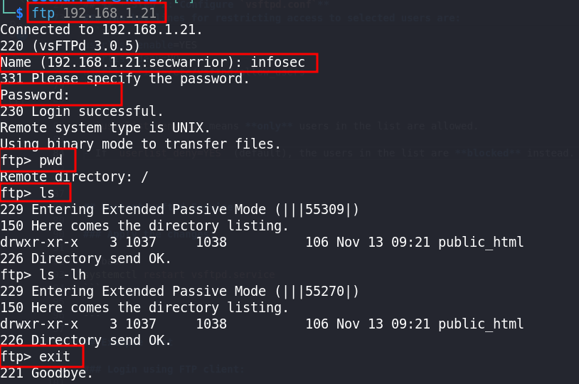

# 🔐 **Login with Selected Users on vsftpd**

You can restrict FTP login access to a specific list of users using the **`userlist_file`** directive in **vsftpd**.

---

## 📝 **Step 1: Create the Allowed Users File**

Edit or create the following file:

```bash
vim /etc/vsftpd/allow_users
```

Add the usernames you want to allow:

```
infosec
sec-learner
u1
```

> ✅ **Only these users will be allowed** to log in via FTP.

---

## ⚙️ **Step 2: Configure `vsftpd.conf`**

Edit the main configuration file:

```bash
vim /etc/vsftpd/vsftpd.conf
```

Ensure the following lines are present or updated correctly:

```ini
# Enable local users to log in
local_enable=YES

# Enable write commands like STOR
write_enable=YES

# Allow passive FTP range
pasv_enable=YES
pasv_min_port=55000
pasv_max_port=55999

# Custom FTP login banner
ftpd_banner=Welcome to ARMOUR FTP service.

# Restrict access to only specified users
userlist_enable=YES
userlist_deny=NO
userlist_file=/etc/vsftpd/allow_users

# Allow chroot with write access if needed
allow_writeable_chroot=YES

# PAM authentication service
pam_service_name=vsftpd

# Use TCP Wrappers for host-based access control
tcp_wrappers=YES

# Enable IPv6 (vsftpd runs in standalone mode if listen=YES)
listen=NO
listen_ipv6=YES
```

---

### The key lines for restricting access to selected users are:

```ini
userlist_enable=YES
userlist_deny=NO
userlist_file=/etc/vsftpd/allow_users
```


- `userlist_deny=NO` means **only** users in the list are allowed.

- If `userlist_deny=YES` (default), the users in the list are **blocked** instead.

---

## Restart vsftpd Service

### Apply the changes:

```bash
systemctl restart vsftpd.service
```

---

## Example Test

### Login using FTP client:

```bash
ftp <your-server-ip>
```


* Try logging in as one of the allowed users (e.g., **u1**) and verify access.
* Any other users should receive a login denial.

---

## Notes

* Make sure **ftpusers** and **user_list** files **do not block** your allowed users.
* If a user appears in `/etc/vsftpd/ftpusers` or `/etc/vsftpd/user_list`,
  they will be **blocked even if** they are listed in `allow_users`.
* To avoid this, comment out or remove those users from these two files.

