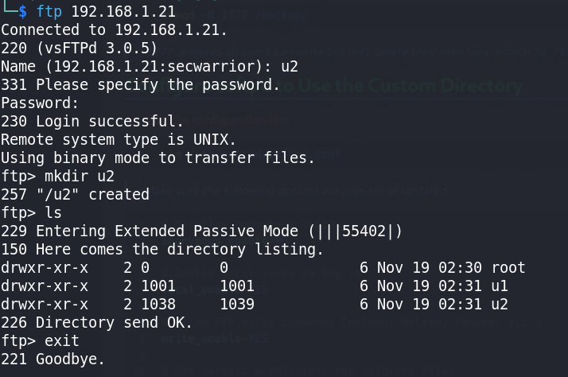

# 📁 **FTP Path Configuration in vsftpd**

* 📌 This section walks through how to set a custom FTP root directory (e.g., `/backup`) for all FTP users using **vsftpd**.

---

## 🛠️ **Create and Set Permissions on the FTP Directory**

### 📂 Create a shared directory for FTP users:

```bash
mkdir /backup/
```

### 🔐 Set permissive permissions to allow access:

```bash
chmod -R 1777 /backup/
```

> 📝 **1777** ensures all users can write but only delete their own files, similar to `/tmp`.
> Adjust permissions based on your security policy.

---

## ⚙️ **Configure vsftpd to Use the Custom Directory**

### ✏️ Edit the configuration file:

```bash
vim /etc/vsftpd/vsftpd.conf
```

### ✅ Make sure the following options are present or updated:

```ini
# 🚫 Disallow anonymous logins
anonymous_enable=NO

# 👤 Enable local users to log in
local_enable=YES

# ✍️ Allow FTP write commands (upload, delete, rename, etc.)
write_enable=YES

# 🎛️ Set default permissions for uploaded files
local_umask=022

# 💬 Show directory welcome messages
dirmessage_enable=YES

# 📁 Log uploads/downloads
xferlog_enable=YES
xferlog_std_format=YES

# 🔌 Use port 20 for data connections
connect_from_port_20=YES

# 🎌 Customize FTP banner
ftpd_banner=Welcome to ARMOUR FTP service.

# 🏠 Chroot users to their home directory (or specified path)
chroot_local_user=YES

# ✍️ Allow writable chroot directories
allow_writeable_chroot=YES

# 📂 Set the custom root directory for all users
local_root=/backup

# 🌐 Passive mode settings (adjust as needed)
pasv_enable=YES
pasv_min_port=55000
pasv_max_port=55999

# 🔐 Use PAM for authentication
pam_service_name=vsftpd

# 🛡️ Use host-based access control (via /etc/hosts.allow and /etc/hosts.deny)
tcp_wrappers=YES

# 🌍 Listen on IPv6 (set `listen=YES` instead for IPv4)
listen=NO
listen_ipv6=YES

# 🔏 Optional: Restrict access to a list of allowed users
userlist_enable=YES
userlist_deny=NO
userlist_file=/etc/vsftpd/allow_users
```
- Changes Lines:

Remove lines
```bash
userlist_enable=YES
userlist_deny=NO
userlist_file=/etc/vsftpd/allow_users
```
add lines:
```bash
local_root=/backup
```
### check and Compare this lines:
```bash
grep -v '#' /etc/vsftpd/vsftpd.conf
```
```ini
anonymous_enable=YES
local_enable=YES
local_root=/backup
write_enable=YES
local_umask=022
anon_upload_enable=YES
anon_mkdir_write_enable=YES
dirmessage_enable=YES
xferlog_enable=YES
connect_from_port_20=YES
xferlog_std_format=YES
chroot_local_user=YES
listen=NO
listen_ipv6=YES

allow_writeable_chroot=YES

pasv_enable=YES

pam_service_name=vsftpd
userlist_enable=YES
pasv_min_port=55000
pasv_max_port=55999
pasv_enable=YES
```
---

## 🔄 **Restart the FTP Service**

### 🛠️ Apply the new settings:

```bash
systemctl restart vsftpd.service
```

---

## 🧪 **Testing**

### 👤 Create a local user (if not already existing):

```bash
adduser ftpuser
```

### ➕ Add the user to the allowed list (if using `userlist_enable`):

```bash
echo "ftpuser" >> /etc/vsftpd/allow_users
```

### 🌐 Try connecting via FTP:

```bash
ftp <your-server-ip>
```

---

## 📚 **Additional Reference**

DigitalOcean guide for vsftpd user directory setup:
[https://www.digitalocean.com/community/tutorials/how-to-set-up-vsftpd-for-a-user-s-directory-on-ubuntu-16-04](https://www.digitalocean.com/community/tutorials/how-to-set-up-vsftpd-for-a-user-s-directory-on-ubuntu-16-04)

---

## 📝 **Notes**

* 🔐 If using `chroot_local_user=YES`, make sure users do **not** have write permission to their chroot directory unless `allow_writeable_chroot=YES` is set.
* 📂 `local_root=/backup` makes **all FTP users land in `/backup`**, not their own `/home/username` directories.
  Use per-user configuration or scripts if you need individual directories.

---
