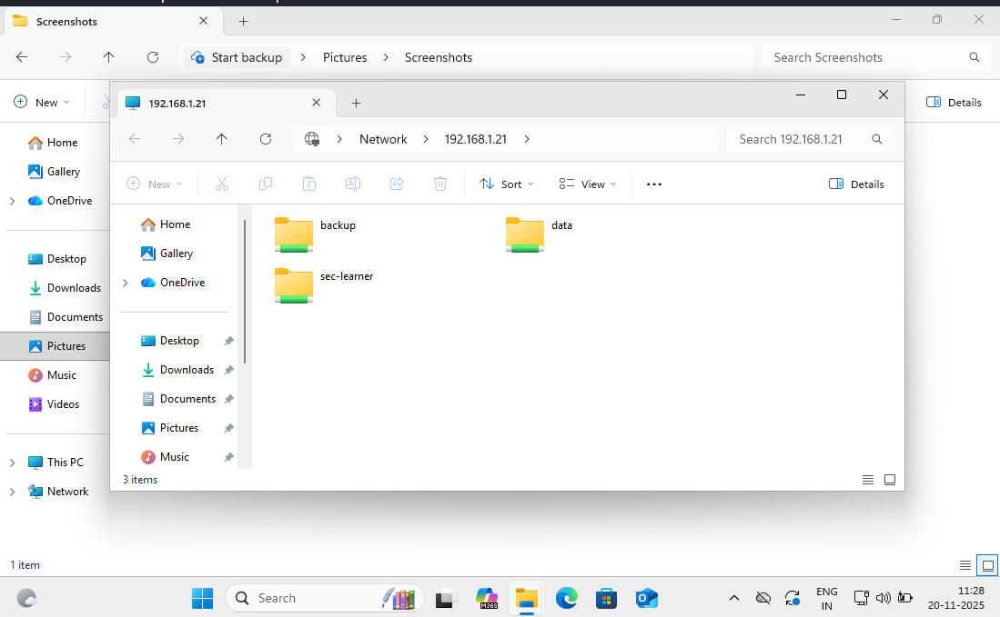

# 📂 Shared Common Directories With Samba

This setup demonstrates how to share directories such as **/opt/data** and **/backup** over the network using **Samba**, with appropriate permissions and configurations.

---

## 📌 Create And Prepare Shared Directories

### 📁 Create the `data` directory under `/opt` :

```bash
cd /opt/
```

```bash
mkdir -v data
```

### 🔓 Set wide-open permissions (read/write/execute for all users):

```bash
chmod 777 /opt/data/
```

---

### 📁 Create the `backup` directory:

```bash
mkdir /backup/
```

### 🛡️ Set sticky bit and full permissions to preserve file ownerships while allowing write access:

```bash
chmod -R 1777 /backup/
```

> ℹ️ **1777** permission allows anyone to write to the directory but only the owner can delete their files — commonly used for directories like **/tmp**.

---

## 🛠️ Configure Samba Shared Folders

Edit the Samba configuration file:

```bash
vim /etc/samba/smb.conf
```


Update or append the following sections in the configuration:

---

```ini
[global]
    workgroup = SAMBA
    security = user
    passdb backend = tdbsam

    printing = cups
    printcap name = cups
    load printers = yes
    cups options = raw

[homes]
    comment = Home Directories
    valid users = %S, %D%w%S
    browseable = No
    read only = No
    inherit acls = Yes

[printers]
    comment = All Printers
    path = /var/tmp
    printable = Yes
    create mask = 0600
    browseable = No

[print$]
    comment = Printer Drivers
    path = /var/lib/samba/drivers
    write list = @printadmin root
    force group = @printadmin
    create mask = 0664
    directory mask = 0775

[data]
    comment = Data
    path = /opt/data
    public = yes
    writable = yes
    guest ok = no
    guest only = no

[backup]
    comment = Server Backup
    path = /backup
    public = yes
    writable = yes
```

---
## 🔄 Restart Samba Service

- Apply the configuration changes:

```bash
systemctl restart smb.service
````

---

## 📂 Accessing The Shares

* You can test the shares using `smbclient` from another Linux machine:

```bash
smbclient -L //your_server_ip -U your_samba_user
```
```bash
smbclient -L //192.168.1.21 -U sec-learner
```
```bash
smbclient //192.168.1.21/data -U sec-learner
```
```bash
smbclient //192.168.1.21/backup -U sec-learner
```
---
## Now check on your `Windows 11` Clinet

Start Virtual Client on your window 

- Press (WIN+R) > type your server IpAddress `\\192.168.1.21` > Ok > Check below Image


---
## mount the share using:

```bash
mount -t cifs //192.168.1.21/data /mnt/data -o username=your_samba_user,password=your_password,vers=3.0
```

* For the backup share:

```bash
mount -t cifs //192.168.1.33/backup /mnt/backup -o username=your_samba_user,password=your_password,vers=3.0
```

---

## 🔐 Access Control Note

* Although `public = yes` is set, `guest ok = no` ensures only authenticated users can access these shares.
* You can manage permissions more tightly by adding **valid users** or **write list** directives as needed.
---
