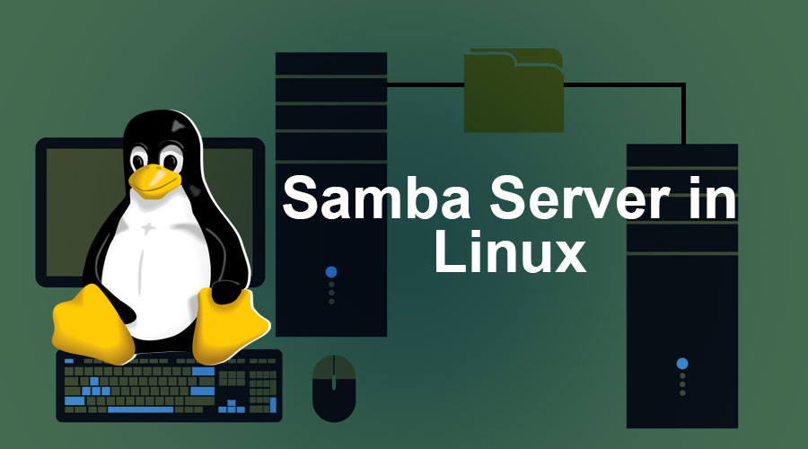

# 🖥️ Samba (SMB/CIFS) Server & File Sharing Guide

This repository provides detailed and practical documentation for configuring **Samba**, managing SMB/CIFS file sharing, and using Samba client tools across Linux systems.

## 📁 Documentation Index

### 🏗️ Samba Server Configuration
- [001 — Samba SMB/CIFS Server Overview](001-Samba-SMB-CIFS-Server.md)
- [003 — Samba Server Setup on RHEL](003-Samba%20Server%20Setup%20On%20RHEL.md)
- [004 — Shared Common Directories with Samba](004-Shared%20Common%20Directories%20With%20Samba.md)
- [005 — Share with Selected Users](005-Share-With-Selected-Users.md)
- [006 — Anonymous Samba Share](006-Anonymous-Samba-Share.md)

### 💻 Samba Client Tools
- [002 — Samba Client Tools](002-Smb%20Client%20Tools.md)

## 🚀 Purpose
These guides help you understand and use Samba to:
- Create SMB/CIFS network shares
- Connect Linux or Windows systems to shared resources
- Configure authenticated and anonymous access
- Manage user permissions and secure directories
- Configure Samba server on RHEL and Debian-based systems

## 📌 Notes
- Compatible with Windows, Linux, and macOS SMB clients
- Includes real-world examples and recommended configurations
- Ideal for SysAdmins, DevOps engineers, and users managing cross-platform networks

---
