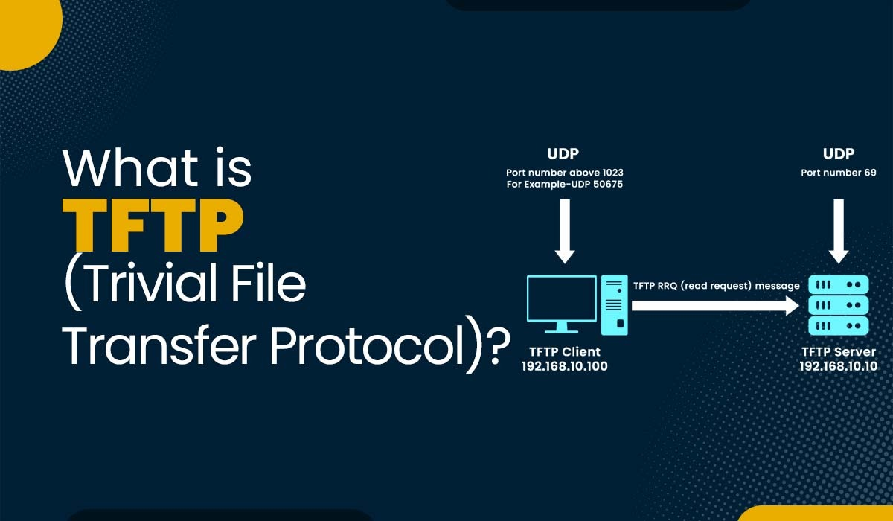

# 📦 TFTP (Trivial File Transfer Protocol) Server & Client Guide

This repository contains documentation for configuring a **TFTP server** and using the **TFTP client** for lightweight file transfers across a network.

## 📁 Documentation Index

- [001 — TFTP Server Configuration](001-Trivial-File-Transfer-Protocol%20(TFTP)%20Server.md)
- [002 — TFTP Client Usage](002-TFTP-Client.md)

## 🚀 Purpose
These guides help you learn how to:
- Install and configure a TFTP server
- Manage TFTP directory permissions and security
- Upload/download files using the TFTP client
- Use TFTP for network booting, routers, switches, and embedded devices

## 📌 Notes
- TFTP is **not secure**, so use it only in trusted networks.
- Typically used for PXE booting, firmware uploads, and network appliances.
- Examples included for practical usage.

---