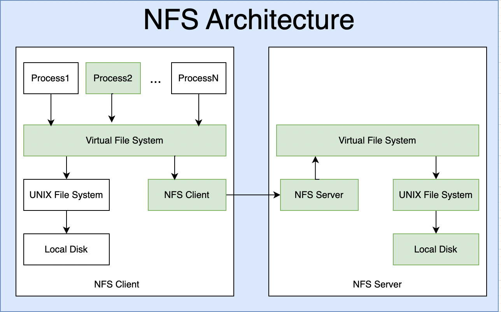

# NFS (Network File System) Guide

This repository contains guides for setting up and managing an NFS server and client.

## 📁 Documentation

- [001 - Network File System (NFS) Server](001-Network-File-System-(NFS)-Server.md)
- [002 - NFS Client Setup and Mounting](002-NFS-Client-Setup-and-Mounting.md)

## 🚀 Purpose
These guides help you install, configure, and use NFS for file sharing between Linux systems.

## 📌 Notes
- Ensure both server and client systems have proper firewall and network configurations.
- Test mounts carefully before enabling auto-mounts.

---