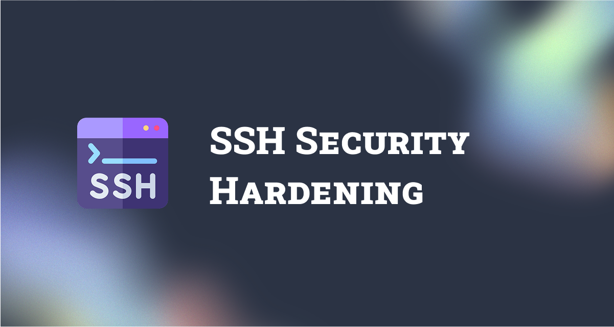

# SSH Hardening Guide

This repository contains a set of guides focused on securing and hardening your SSH configuration.

## 📁 Documentation

- [001 - SSH (Secure Shell) Server](001-SSH%20(Secure%20Shell)%20Server.md)
- [002 - Change Default SSH Port](002-Change-Default-SSH-Port.md)
- [003 - Bind SSH To A Specific IP Address](003-Bind%20SSH%20To%20A%20Specific%20IP%20Address.md)
- [004 - Prevent Root Login via SSH](004-Prevent-Root-Login-via-SSH.md)

## 🚀 Purpose
This collection helps improve the security of your server by applying best practices to your SSH setup.

## 📌 Notes
- Ensure you have console access before making SSH changes.
- Test configuration using a second SSH session before closing the first.
