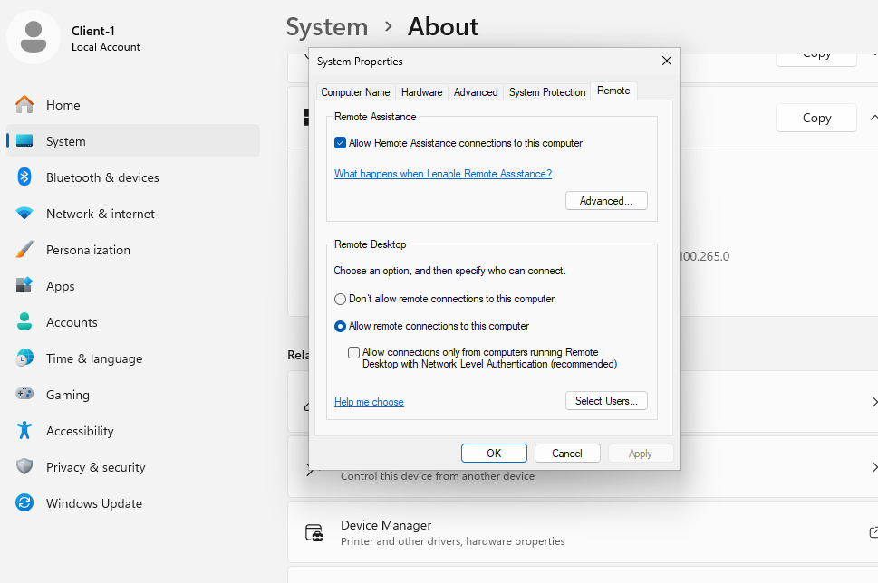
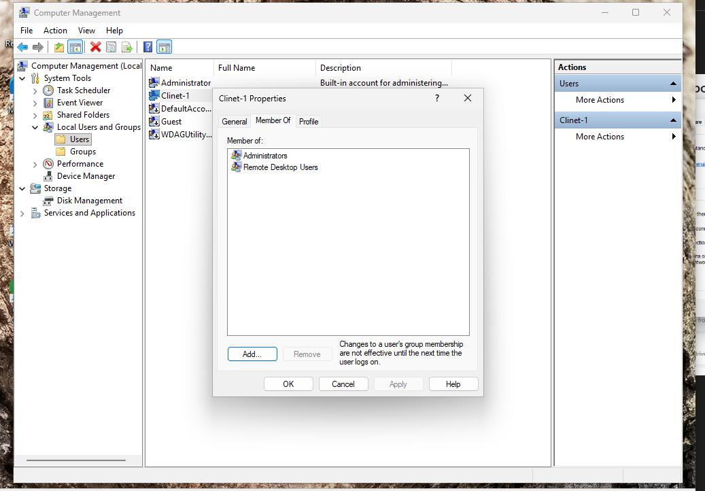
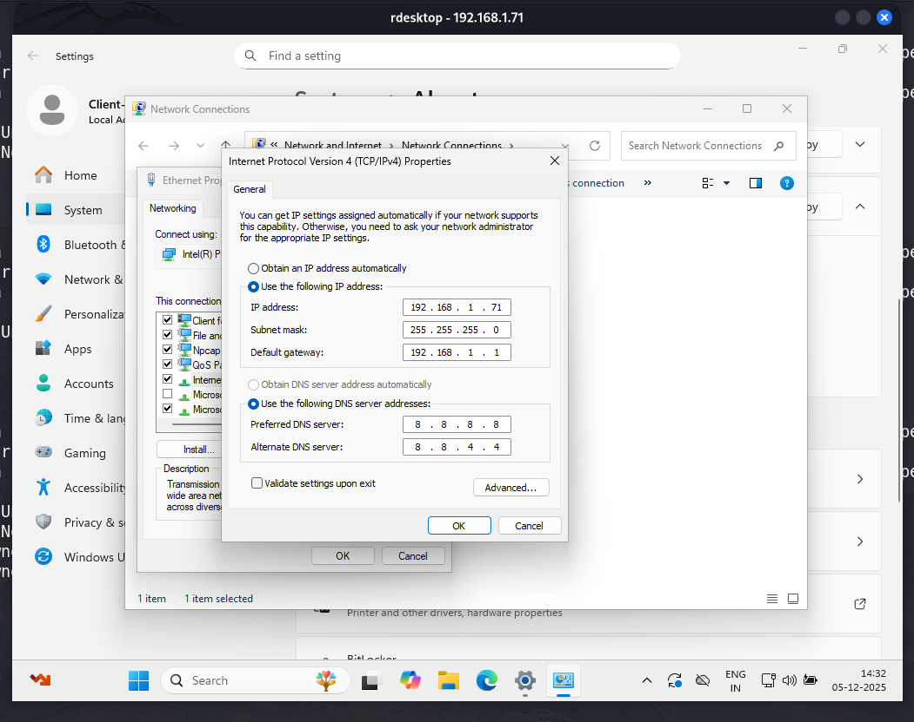
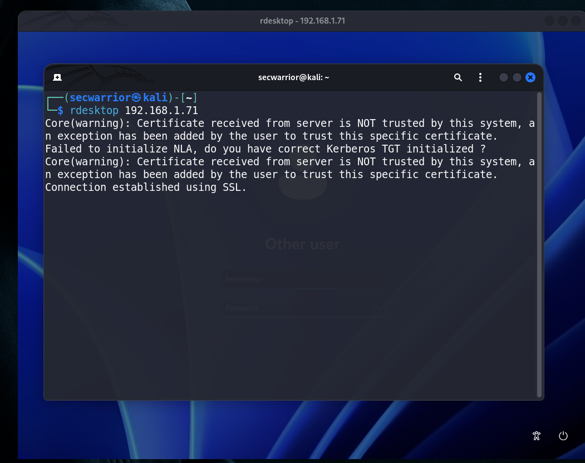
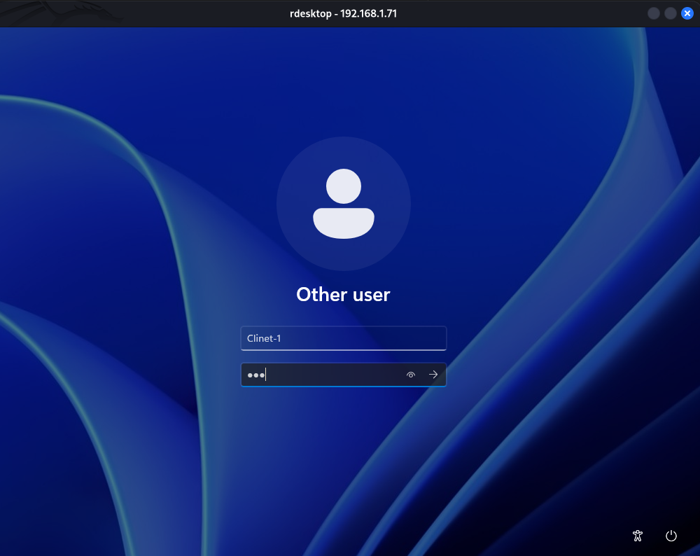

# 🖥️ RDesktop – Remote Desktop Connection Setup (Kali Linux → Windows)

RDesktop is **already installed** by default in Kali Linux, so you can directly use it to connect to Windows systems using the RDP (Remote Desktop Protocol).

---

## 🧩 **Client PC (Windows) Configuration**

Before connecting from Kali Linux, ensure that the Windows machine allows RDP connections.

---

## ✅ **1. Enable Remote Desktop**

Go to:

**Settings → System → Remote Desktop**

Make sure **Remote Desktop = Enabled** ✔️



---

## ✅ **2. Allow User for Remote Desktop**

Windows requires users to be part of the **Remote Desktop Users** group to allow login.

### Check or Add User:





⚠️ *If your user is not in the Remote Desktop Users group, you must add it. Otherwise, remote login will fail.*

---

## 🧪 **Connecting from Kali Linux**

Use the following command:

```bash
rdesktop 192.168.1.71
```
- rdesktop with `username` and `Password`

```bash
rdesktop 192.168.1.71 -u clinet-1 -p 123
```

📌 This command attempts to connect using RDP on the **default port 3389**.

---

## **Example**

If you see an error like this:



Or this:



---
