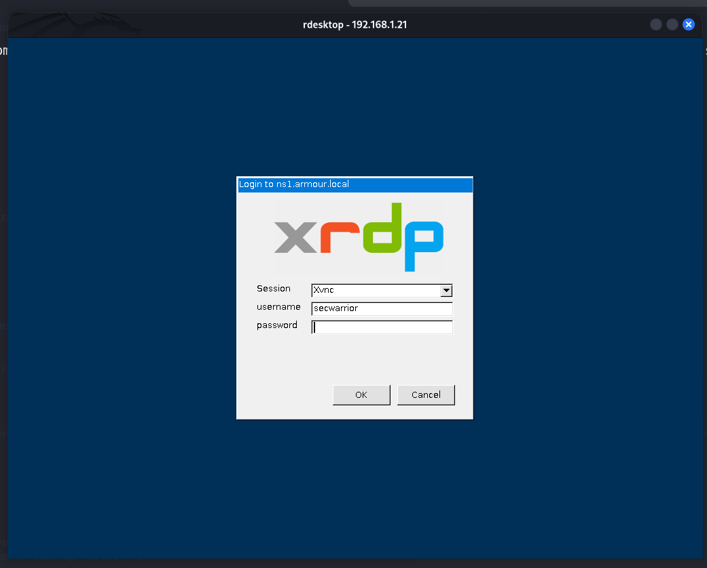

# 🖥️ XRDP Server Setup  
## XRDP Server

## 🧰 Installing GUI on Server  

Install the GUI environment:

```bash
yum groups install "Server with GUI"
```

✔️ Installs a graphical user interface, required for remote desktop access.

---

## 🔍 Verifying XRDP Installation

Check if xrdp is already installed:

```bash
rpm -qa | grep xrdp
```

📌 Lists installed packages matching **xrdp**.

---

## 📦 Install XRDP Using YUM

```bash
yum install xrdp
```

⬇️ Downloads and installs the **xrdp** package.

---

## 🔁 Re-check if XRDP Installed

```bash
rpm -qa | grep xrdp
```

---

## 📘 Display Detailed Information About XRDP

```bash
rpm -qi xrdp
```

ℹ️ Shows package metadata, version, release, build date, etc.

---

## 📂 List Files Installed by XRDP

```bash
rpm -ql xrdp
```

📁 Displays all files installed by the **xrdp** package.

---

## ⚙️ List XRDP Configuration Files

```bash
rpm -qc xrdp
```

🛠️ Shows configuration file locations.

---

## 🔐 Configuring XRDP SSL Protocols

### ✏️ Edit the xrdp configuration:

```bash
vim /etc/xrdp/xrdp.ini
```

### Set SSL protocols inside the **[Globals]** section:(Line no 66)

```ini
ssl_protocols=TLSv1, TLSv1.1, TLSv1.2, TLSv1.3
```

🔒 Ensures secure TLS protocol support for XRDP.

```bash
cat /etc/xrdp/xrdp.ini | grep -vE '^;|^#|^$'
```

```ini
[Globals]
ini_version=1
fork=true
port=3389
runtime_user=xrdp
runtime_group=xrdp
tcp_nodelay=true
tcp_keepalive=true
security_layer=negotiate
crypt_level=high
certificate=
key_file=
ssl_protocols=TLSv1, TLSv1.1, TLSv1.2, TLSv1.3
autorun=
allow_channels=true
allow_multimon=true
bitmap_cache=true
bitmap_compression=true
bulk_compression=true
max_bpp=32
new_cursors=true
use_fastpath=both
grey=e1e1e1
dark_grey=b4b4b4
blue=0078d7
dark_blue=0078d7
ls_top_window_bg_color=003057
ls_width=350
ls_height=360
ls_bg_color=f0f0f0
ls_logo_filename=
ls_logo_transform=scale
ls_logo_width=250
ls_logo_height=110
ls_logo_x_pos=55
ls_logo_y_pos=35
ls_label_x_pos=30
ls_label_width=68
ls_input_x_pos=110
ls_input_width=210
ls_input_y_pos=158
ls_btn_ok_x_pos=142
ls_btn_ok_y_pos=308
ls_btn_ok_width=85
ls_btn_ok_height=30
ls_btn_cancel_x_pos=237
ls_btn_cancel_y_pos=308
ls_btn_cancel_width=85
ls_btn_cancel_height=30
[Logging]
LogFile=xrdp.log
LogLevel=INFO
EnableSyslog=true
[LoggingPerLogger]
[Channels]
rdpdr=true
rdpsnd=true
drdynvc=true
cliprdr=true
rail=true
xrdpvr=true
[Xvnc]
name=Xvnc
lib=libvnc.so
username=ask
password=ask
port=-1
code=1
```

---
## 🔄 Restarting XRDP Service

### Restart xrdp to apply configuration changes:

```bash
systemctl restart xrdp.service
```

### Enable xrdp service at boot:

```bash
systemctl enable xrdp.service
```

---

## 🎧 Verifying XRDP Port Listening

### Check if xrdp is listening on TCP port **3389**:

```bash
netstat -nltup | grep 3389
```

✔️ Confirms the network service is active.

---

## 🔥 Firewall Configuration Using Firewalld

## 🚪 Opening Port 3389

Allow TCP port **3389** for XRDP:

```bash
firewall-cmd --permanent --add-port=3389/tcp
```

🔓 Opens the remote desktop port permanently.

---

## 🔄 Reload Firewall to Apply Changes

```bash
firewall-cmd --reload
```

---

## 📜 Verifying Open Ports

List all allowed ports:

```bash
firewall-cmd --list-ports
```
---

## 🔍 Check Active Firewall Zones

To check which firewall zones are currently active:

```bash
firewall-cmd --get-active-zones
```

---

## 🌐 List Ports in the Public Zone

```bash
firewall-cmd --zone=public --list-ports
```

---

## 🔌 Connecting to the XRDP Server

### Connect from a client machine:

```bash
rdesktop 192.168.1.21
```


- Enter a `Username` ,`Password`

🔁 Replace **192.168.1.37** with your server’s actual IP address.
🖥️ Alternatively, use **Windows Remote Desktop (mstsc)**.

---

## 🛡️ Configuring SELinux for XRDP

Adjust SELinux context for XRDP binaries:

```bash
chcon --type=bin_t /usr/sbin/xrdp
```

```bash
chcon --type=bin_t /usr/sbin/xrdp-sesman
```

✔️ Helps prevent SELinux from blocking XRDP.

---

## 📌 Additional Notes

- 🔐 Configure **SSL certificates** for production environments.
- 🎨 Customize the **login screen appearance** using settings inside **[Globals]**.
- 🛠️ Troubleshoot connection issues by checking **xrdp logs** and **SELinux audit logs**.
- 🔒 Always use **secure passwords** and keep your packages **updated regularly**.

---