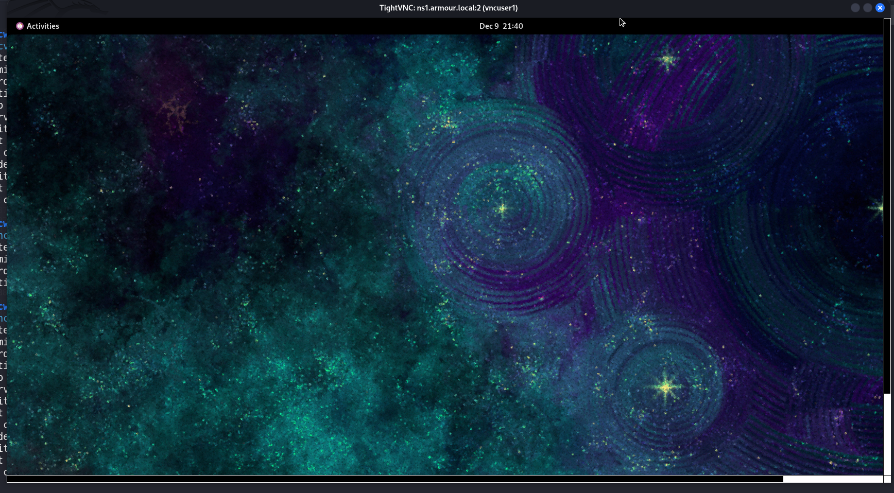

# **VNC-Server 🖥️**
### It is a remote desktop sharing system that allows you to control another computer’s graphical desktop from anywhere.

## **VNC (Virtual Network Computing)**

### **1. Check if any VNC packages are already installed 🔍**

```bash
rpm -qa | grep vnc
```

---

### **2. Verify SELinux status 🛡️**

```bash
sestatus
```

---

### **3. Install the TigerVNC server and necessary fonts 📦**

The `xorg-x11-fonts-Type1` package ensures compatibility with graphical sessions.

```bash
yum install tigervnc-server xorg-x11-fonts-Type1
```

---

### **4. Install all packages related to tigervnc ⭐**

```bash
yum install tigervnc*
```

---

# **3. Verify Installed VNC Packages, Dependencies, And Files ✅**

### **Check detailed package information for `tigervnc-server` 📘**

```bash
rpm -qi tigervnc-server
```

---

### **Display all the dependencies required by `tigervnc-server` 📦➡️📦**

```bash
rpm -qd tigervnc-server
```

---

### **List all the files installed by `tigervnc-server` 📂**

```bash
rpm -ql tigervnc-server
```

---

### **Display configuration files related to `tigervnc-server` ⚙️**

```bash
rpm -qc tigervnc-server
```
---

## **Create VNC Users 👥**

### **• Create new users that will access the VNC sessions 👇**

```bash
useradd vncuser1
```

```bash
useradd vncuser2
```

### **• Set passwords for the created users 🔐**

```bash
passwd vncuser1
```

```bash
passwd vncuser2
```

---

## **Set VNC Passwords For The Users 🔑**

### **Switch to the user accounts and set individual VNC session passwords 👤**

---

### **Switch to `vncuser1`**

```bash
su - vncuser1 -c "vncserver :2 -geometry 1920x1080 -depth 24"
```

---

### **Switch to `vncuser2`**

```bash
su - vncuser2 -c "vncserver :3 -geometry 1920x1080 -depth 24"
```

### **Switch to `vncuser3`**

```bash
su - vncuser3 -c "vncserver :4 -geometry 1920x1080 -depth 24"
```
---

## **Configure VNC Users And Display Numbers 🖥️👥**

### **Edit the `/etc/tigervnc/vncserver.users` file to map display numbers to users ✏️**

```bash
vim /etc/tigervnc/vncserver.users
```

---

### **Example content 📄**

```bash
# TigerVNC user assignment
#
# This file assigns users to specific VNC display numbers.
# The syntax is <display>=<username>. E.g.:
#
# :2=andrew
# :3=lisa
:2=vncuser1
:3=vncuser2
:4=vncuser3
```

---

🔢 **Each display number (`:2`, `:3`, etc.) maps to a different user session.**

---

## **Create And Configure VNC Systemd Service Files ⚙️🖥️**

### **Create custom systemd unit files to manage VNC server instances for each user 👥**

---

### **1. List the default VNC service template 📄**

```bash
ls -lh /lib/systemd/system/vncserver@.service
```

---

### **2. Create and edit the service file for Display `:2` ✏️**

```bash
vim /etc/systemd/system/vncserver@:2.service
```

---

### **Example content 📘`user1`**

```ini
[Unit]
Description=Remote Desktop Service (VNC)
After=syslog.target network.target

[Service]
Type=forking
User=vncuser1
PAMName=system-auth
PIDFile=/home/vncuser1/.vnc/%H%i.pid
ExecStart=/usr/bin/vncserver -fg -geometry 1920x1080 -depth 24 :2
ExecStop=/usr/bin/vncserver -kill :2

[Install]
WantedBy=multi-user.target
```

---

## **Copy the service file for the second user 👤➡️👤**

```bash
cp -v /etc/systemd/system/vncserver@:2.service /etc/systemd/system/vncserver@:3.service
```

---

### **Edit the new service file for Display `:3` 📝**

```bash
vim /etc/systemd/system/vncserver@:3.service
```

---

### **Example content for Display `:3` `user2`📘**

```ini
[Unit]
Description=Remote Desktop Service (VNC)
After=syslog.target network.target

[Service]
Type=forking
User=vncuser2
PAMName=system-auth
PIDFile=/home/vncuser2/.vnc/%H%i.pid
ExecStart=/usr/bin/vncserver -fg -geometry 1920x1080 -depth 24 :3
ExecStop=/usr/bin/vncserver -kill :3

[Install]
WantedBy=multi-user.target
```


---

### **Edit the new service file for Display `:3` `user3`📝**

```bash
vim /etc/systemd/system/vncserver@:4.service
```

---

### **Example content for Display `:3` 📘**

```ini
[Unit]
Description=Remote Desktop Service (VNC)
After=syslog.target network.target

[Service]
Type=forking
User=vncuser3
PAMName=system-auth
PIDFile=/home/vncuser3/.vnc/%H%i.pid
ExecStart=/usr/bin/vncserver -fg -geometry 1920x1080 -depth 24 :4
ExecStop=/usr/bin/vncserver -kill :4

[Install]
WantedBy=multi-user.target
```

---

## **Set Permissions, Reload Systemd, Enable And Start Services ⚙️🚀**

### **Set correct permissions for the service files 🔐**

```bash
chmod 755 /etc/systemd/system/vncserver@:2.service /etc/systemd/system/vncserver@:3.service
```

---

### **Reload systemd manager configuration 🔄**

```bash
systemctl daemon-reload
```

---

### **Enable and start VNC services for each display 🖥️**

---

## **Enable and start service for `vncuser1` (Display :2) 👤**

```bash
systemctl enable vncserver@:2.service
```

```bash
systemctl start vncserver@:2.service
```

---


## **Enable and start service for `vncuser2` (Display :3) 👤**

```bash
systemctl enable vncserver@:3.service
```

```bash
systemctl start vncserver@:3.service
```
---
## **Enable and start service for `vncuser3` (Display :4) 👤**

```bash
systemctl enable vncserver@:4.service
```

```bash
systemctl start vncserver@:4.service
```
---

## **Verify VNC Services And Network Ports 🔍🧪**

### **Check service logs for any issues 📝**

```bash
journalctl -u vncserver@:2.service
```

---

### **Check if the VNC server is listening on the correct port 🔌**

```bash
netstat -nltup | grep 5902
```
---

## **Additional Firewall And SELinux Considerations 🔥🛡️**

### **If you are running a firewall, you must allow VNC ports (5901, 5902, etc.)**

#### **Example to open VNC ports permanently 🔓**

```bash
firewall-cmd --permanent --add-port=5901-5910/tcp
firewall-cmd --reload
```

---

### **If SELinux is enforcing and causes issues with VNC, you may need to adjust contexts ⚠️**

#### **Example (for learning, not a complete fix) 📘**

```bash
semanage port -a -t vnc_port_t -p tcp 5901-5910
```
---

## **Connect Using VNC Viewer 🖥️🔗**

* You can use any VNC viewer application to connect to your server.

---

### **Example to view help options ℹ️**

```bash
vncviewer -h
```

---

### **Connect to the server using IP and port 🌐**

```bash
 vncviewer 192.168.1.21:5902
```


🔁 Replace **192.168.1.25** (or **192.168.1.33**) with your actual server IP address.

---
