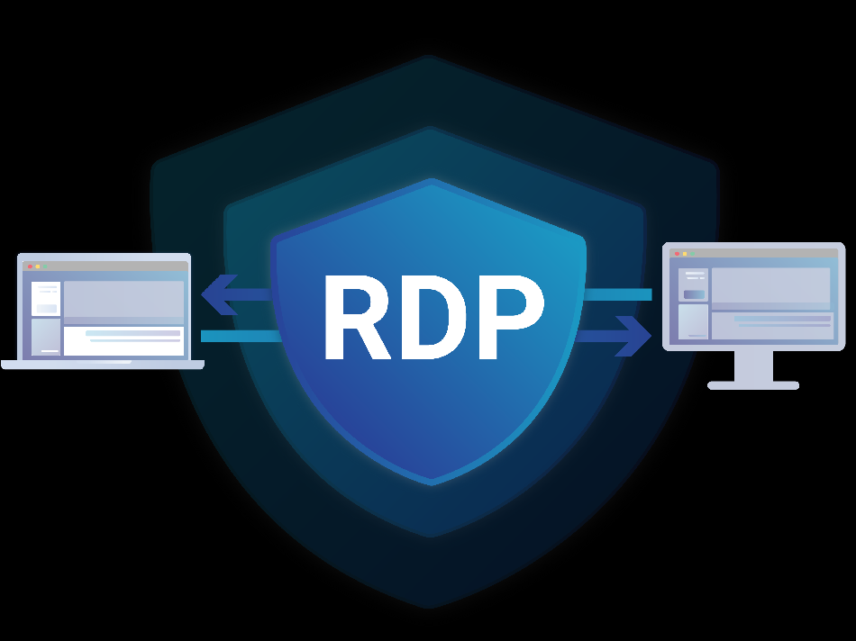

# 🖥️ Remote Desktop & Remote Access

This repository contains guides for setting up and using **Remote Desktop and Remote Access tools** on Linux and Windows systems.

---

## 📚 Documentation Index

1. [Remote Desktop Setup](<001-Remote Desktop Setup.md>)  
2. [RDesktop](002-RDesktop.md)  
3. [xfreerdp](003-xfreedp.md)  
4. [Remmina](004-Remmina.md)  
5. [XRDP Server Setup](<005-XRDP Server Setup.md>)  
6. [VNC Server](006-VNC-server.md)  
7. [NoMachine](007-NoMachine.md)  

---

## 🧾 Overview

These guides are intended for:
- System Administrators  
- DevOps Engineers  
- Linux & Windows Users  
- IT Support Professionals  
---

