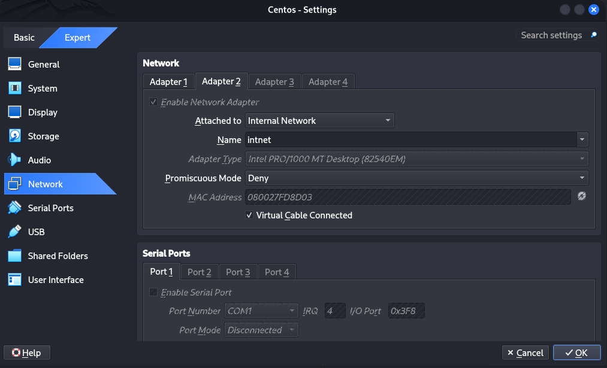
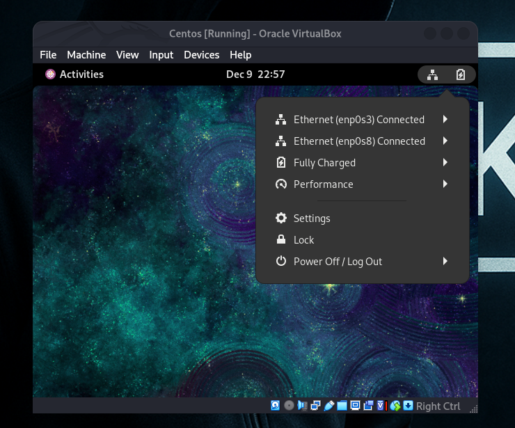
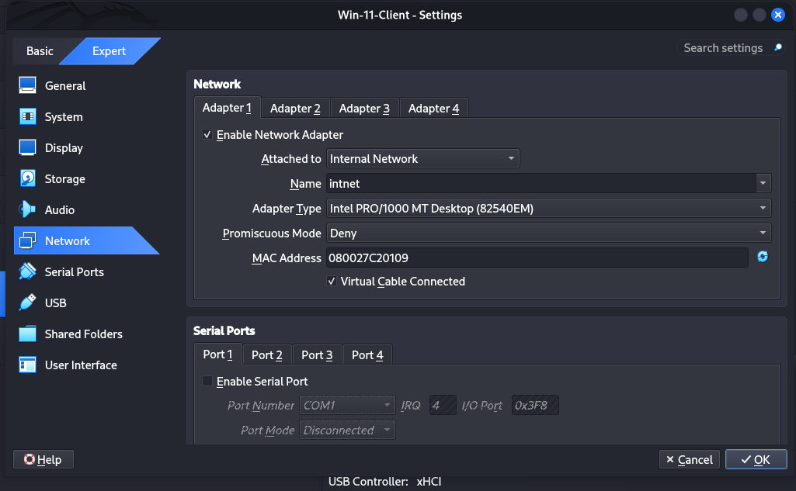
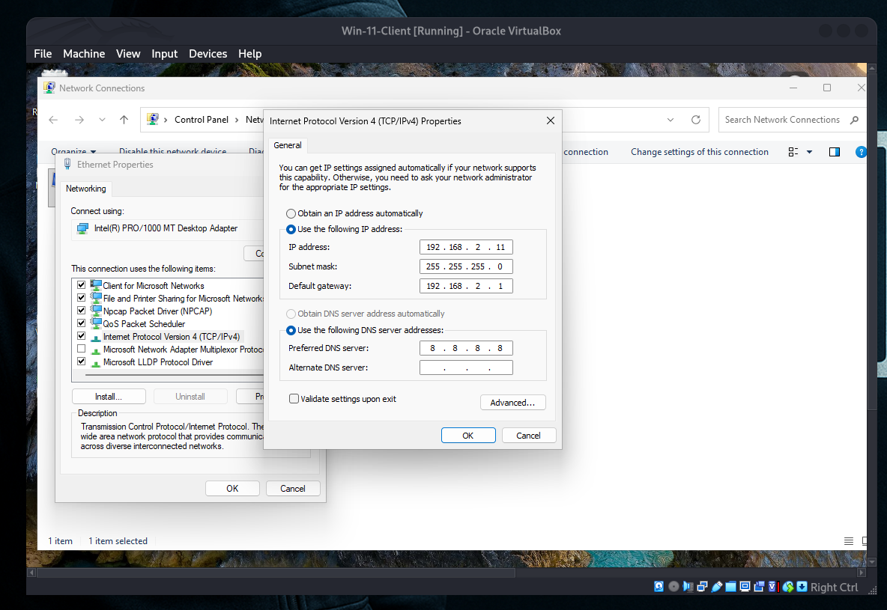
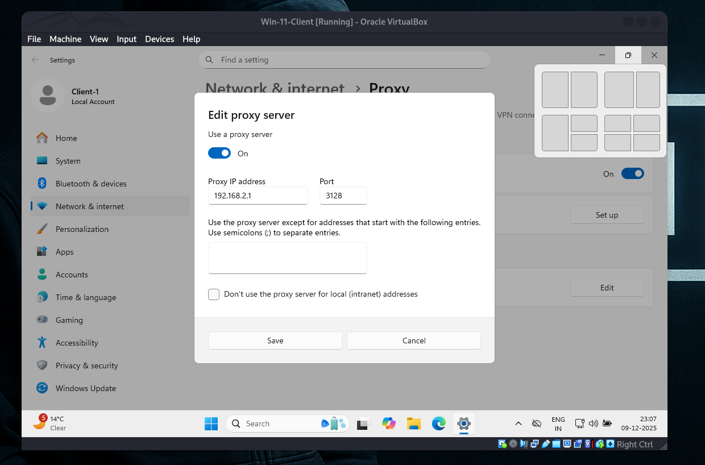
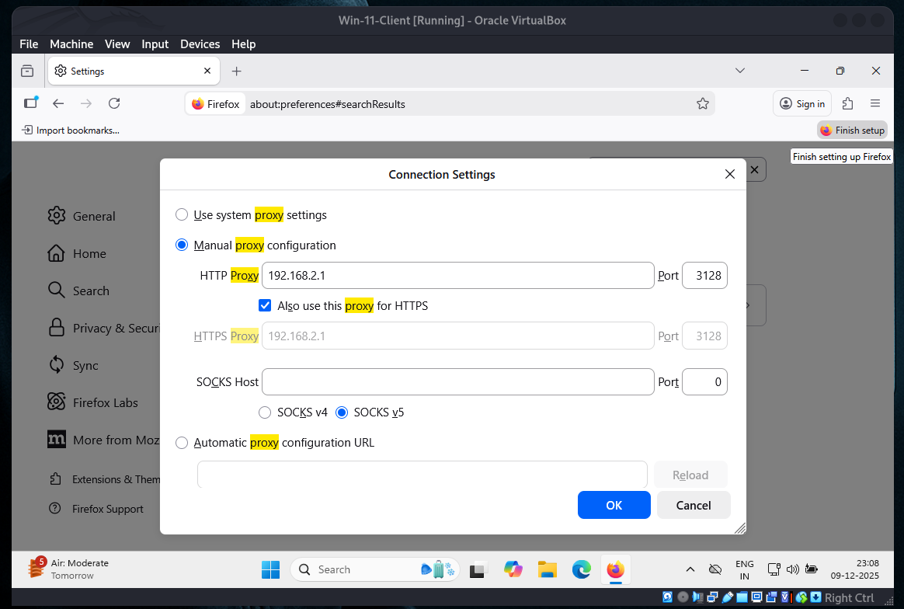

# 🦑 Squid-Proxy-Server-Setup

## 🚀 Squid Proxy Server Setup

- Before start Serve Machine on set `Adaptor 2` setting



- Now on enterface is `enp0s8`



## ✅ 1. Check Repositories And Existing Installation

🔎 *To ensure the system is ready, first check available repositories and whether Squid is already installed.*


### 📁 Check enabled repositories:

```bash
yum repolist all
```

### 🧐 Check if Squid is already installed:

```bash
rpm -qa | grep squid
```

---

## 📥 2. Install Squid

Install the Squid package using **yum**.
The ***** ensures all related packages are installed.

```bash
yum install squid*
```

---

## 🔧 3. Verify Installation

After installation, verify Squid and gather information about its files and configurations.

### 📦 List installed Squid packages:

```bash
rpm -qa | grep squid
```

### 📘 Show detailed information about the Squid package:

```bash
rpm -qi squid
```

### 📂 List Squid Configuration Files

```bash
rpm -qc squid
```

### 📘 List Squid Documentation Files

```bash
rpm -qd squid
```

### 📦 List All Files Installed by Squid

```bash
rpm -ql squid
```

---

## ⚙️ Edit Squid Configuration

✏️ Edit the main Squid configuration file to define access control lists (ACLs), ports, and other rules.

```bash
vim /etc/squid/squid.conf
```

🛠️ *Customize the configuration as needed, for example allowing only internal network access.*

---

## 🚀 Manage Squid Service

Manage Squid service, enable auto-start, start the service, and check its status.

---

### 🔄 Enable Squid to Start Automatically at Boot

```bash
systemctl enable squid.service
```

### ▶️ Start the Squid Service

```bash
systemctl start squid.service
```

### 📊 Check the Status of the Squid Service

```bash
systemctl status squid.service
```
---

### 🔍 Check If Squid Is Listening

Verify if Squid is actively listening on the default proxy port **3128**.

### 📡 Using netstat:

```bash
netstat -nltup | grep squid
```

### 🔍 Alternatively, using ss:

```bash
ss -nltup | grep squid
```

🔎 *Look for Squid binding to TCP port **3128**.*

---

## 🔥 Configure Firewalld Instead Of Iptables

Instead of manually editing **iptables**, use **firewalld** commands for better management.

---

## 🛡️ Check If Firewalld Is Running

Check the status of firewalld:

```bash
systemctl status firewalld
```

---

## 🚀 Start Firewalld If Not Running

### ▶️ Start and enable firewalld:

```bash
systemctl start firewalld
```

### 🔄 Enable firewalld to start on boot:

```bash
systemctl enable firewalld
```

---


## 🔥 Allow Squid Port 3128 in Firewall

Allow incoming TCP traffic to Squid:

```bash
firewall-cmd --permanent --add-port=3128/tcp
```

---

### 🌐 Allow DNS Ports (Optional)

Allow DNS queries if your proxy server must resolve domain names:

```bash
firewall-cmd --permanent --add-port=53/tcp
```

```bash
firewall-cmd --permanent --add-port=53/udp
```

---

## 🔄 Reload Firewalld To Apply Changes

Apply all new firewall rules:

```bash
firewall-cmd --reload
```

---

## 📋 Check Open Ports And Services

List the active firewall settings:

```bash
firewall-cmd --list-all
```

> ✔️ *Now, the Squid proxy server is running, and firewall rules are correctly applied using firewalld.*

---

## Now Open Client PC like windows and Others..







- FireFox Browser set a PROXY



---

## 📊 Monitor Logs And Traffic

Monitoring Squid helps troubleshoot and analyze network usage.

Now you can search on firefox or chrome browser:

You can see the log and traffic bellow cmd:

## 📜 Follow the Squid access log in real-time:

On server commands:

```bash
tail -f /var/log/squid/access.log
```

---

## 🌐 Capture network packets on a specific interface:

Like This 
```bash
1765302240.898 279867 192.168.2.11 TCP_TUNNEL/200 9926 CONNECT aax.amazon-adsystem.com:443 - HIER_DIRECT/18.172.65.161 -
1765302241.917 287204 192.168.2.11 TCP_TUNNEL/200 62345 CONNECT delivery.adrecover.com:443 - HIER_DIRECT/108.158.61.127 -
1765302241.918 213912 192.168.2.11 TCP_TUNNEL/200 5986 CONNECT mab.chartbeat.com:443 - HIER_DIRECT/151.101.210.202 -
1765302241.957 273746 192.168.2.11 TCP_TUNNEL/200 11333 CONNECT prebid.a-mo.net:443 - HIER_DIRECT/131.153.206.101 -
1765302242.178  99391 192.168.2.11 TCP_TUNNEL/200 4186 CONNECT us-east.pgammedia.com:443 - HIER_DIRECT/80.77.87.205 -
1765302242.934 170516 192.168.2.11 TCP_TUNNEL/200 9969 CONNECT a69ce63cb11db2df494c44026bea49b8.safeframe.googlesyndication.com:443 - HIER_DIRECT/142.251.221.225 -
1765302245.063 282815 192.168.2.11 TCP_TUNNEL/200 44848 CONNECT ssl.google-analytics.com:443 - HIER_DIRECT/142.250.207.168 -
1765302246.078 277457 192.168.2.11 TCP_TUNNEL/200 7497 CONNECT jadserve.postrelease.com:443 - HIER_DIRECT/52.209.86.246 -
1765302246.081 212815 192.168.2.11 TCP_TUNNEL/200 5972 CONNECT imprammp.taboola.com:443 - HIER_DIRECT/151.101.209.44 -
```