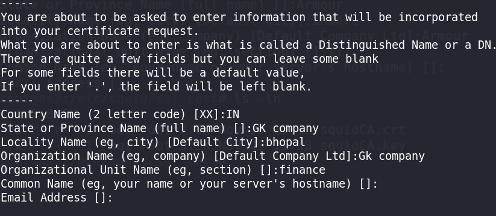
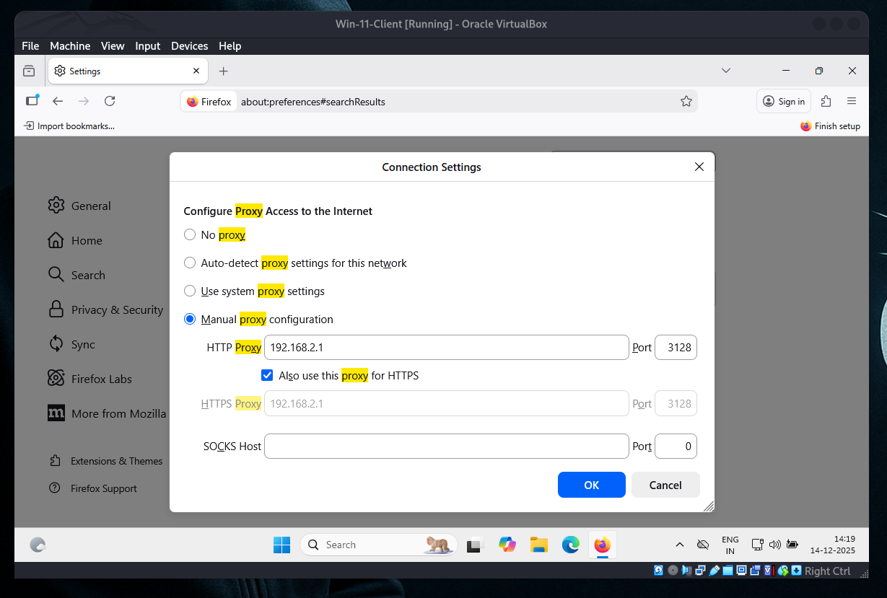
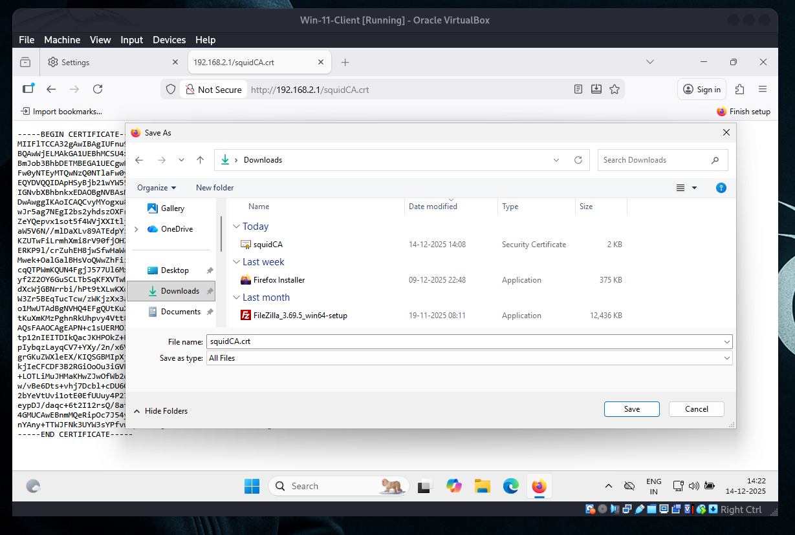
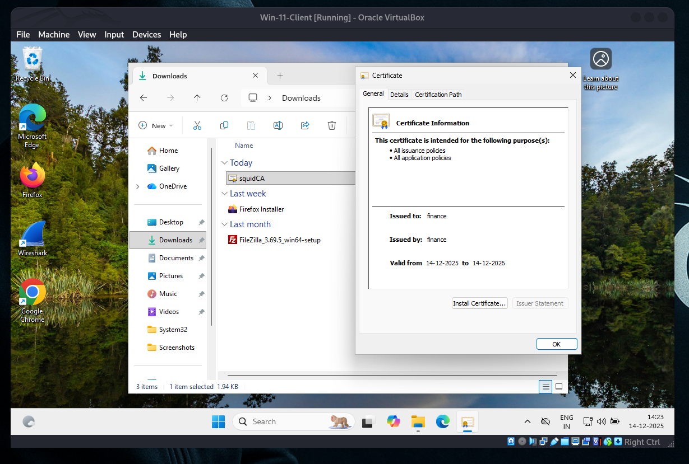
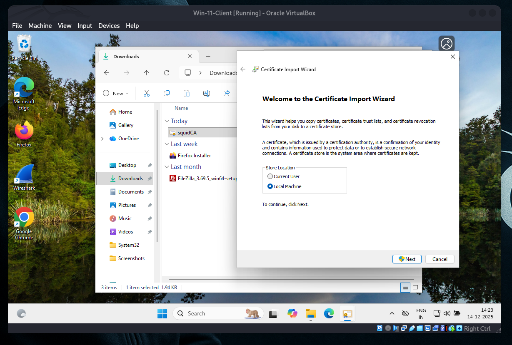
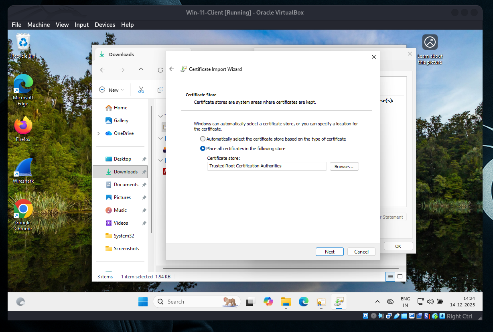
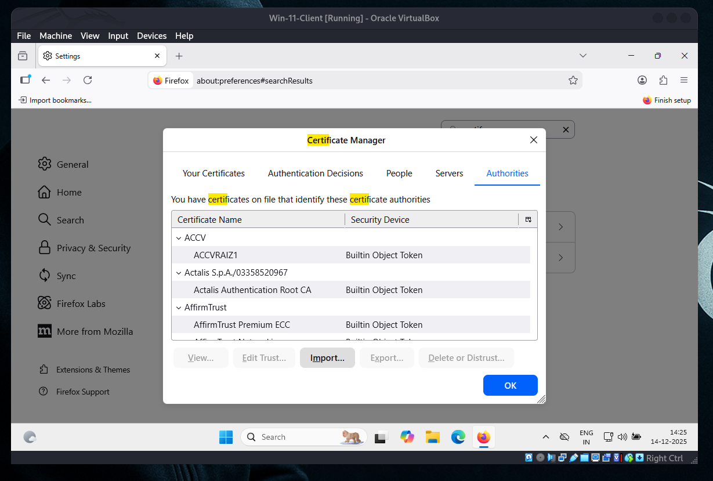
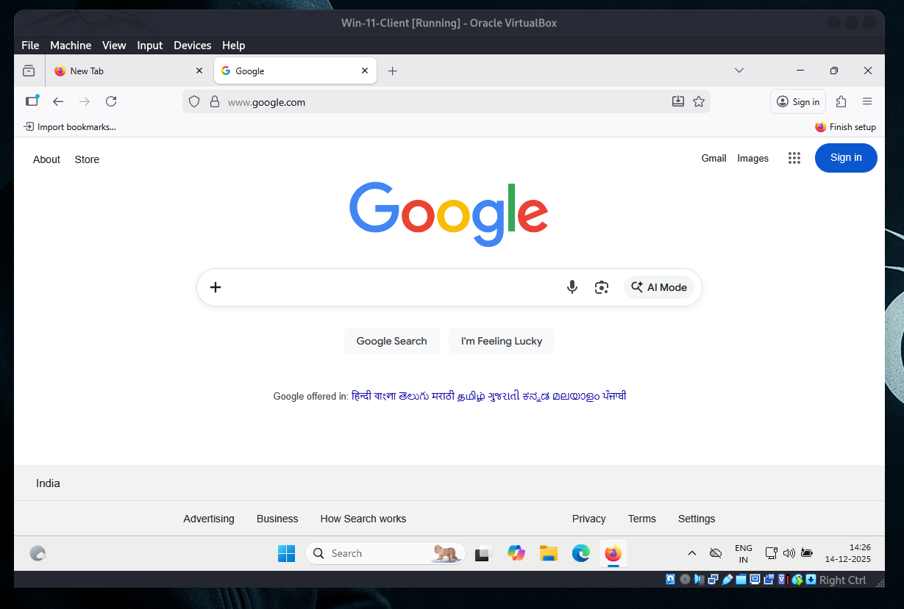

# 🔐 SSL Bump with Squid Proxy

## 🔍 How HTTPS Works

HTTPS uses **Transport Layer Security (TLS)** to securely encrypt communication between clients and servers.

* 🔑 **Private Key**
  Secret key stored securely on the server.

* 🌍 **Public Key**
  Shared publicly; encrypts data that only the private key can decrypt.

✅ This encryption ensures:

* 🔒 **Privacy**
* 🧾 **Integrity**
* ✅ **Authentication**

---

## 🧾 Create SSL Certificates for Squid

First, generate a **self-signed Certificate Authority (CA)** for Squid.

### 📁 Create SSL Certificate Directory

```bash
mkdir -p /etc/squid/ssl_cert
```

```bash
cd /etc/squid/ssl_cert
```

---

### 🔐 Generate CA Certificate & Key

```bash
openssl req -new -newkey rsa:4096 -days 365 -nodes -x509 -keyout squidCA.key -out squidCA.crt
```


```bash
ls -lh
-rw-r--r-- 1 root root 2.0K Dec 14 13:14 squidCA.crt
-rw------- 1 root root 3.2K Dec 14 13:13 squidCA.key
```
---

### 📦 Combine Certificate and Key into PEM File

```bash
cat squidCA.crt squidCA.key > squidCA.pem
```

---

### ✅ Verify Certificate Files

```bash
ls -lh /etc/squid/ssl_cert
```

You should see:

* `squidCA.key` 🔑
* `squidCA.crt` 📜
* `squidCA.pem` 📦

---

## 🗄️ Prepare the SSL Database for Squid

Create and initialize the **SSL database** that Squid uses for **dynamic certificate generation** (required for SSL Bump).

---

### 📁 Create Squid SSL Database Directory

```bash
mkdir -p /var/lib/squid
```

```bash
ls -lh /var/lib/squid
```

---

### 🔐 Initialize the SSL Certificate Database

```bash
/usr/lib64/squid/security_file_certgen -c -s /var/lib/squid/ssl_db -M 200MB
```

📌 **Explanation:**

* `-c` → Create a new database
* `-s` → Path to SSL database
* `-M 200MB` → Cache size for generated certificates

---

### 👤 Fix Ownership Permissions

Ensure Squid owns the SSL database:

```bash
chown -R squid:squid /var/lib/squid/ssl_db/
```

---

### ✅ Verify the SSL Database

```bash
ls -lh /var/lib/squid/ssl_db/
```

You should see multiple subdirectories and files created by Squid.

---

## 🚫 Disable SELinux (Optional)

⚠️ **Note:** Disabling SELinux can help avoid permission issues with SSL Bump,
but it is **not recommended for production** unless properly configured.

### ✏️ Edit SELinux Configuration

```bash
vim /etc/sysconfig/selinux
```

---

### 🔧 Set the Following Value

```conf
SELINUX=disabled
```

---

### 🔍 Check SELinux Status

```bash
sestatus
```
If `disabled` changes have taken effect.

---

## 🔐 Configure Squid for SSL Bump

SSL Bump allows Squid to **decrypt, inspect, and re-encrypt HTTPS traffic**.

---

### ✏️ Edit Squid Configuration File

```bash
vim /etc/squid/squid.conf
```

---

### ⚙️ Add / Update the Following Configuration

```conf
http_port 3128 ssl-bump cert=/etc/squid/ssl_cert/squidCA.pem generate-host-certificates=on dynamic_cert_mem_cache_size=4MB

acl step1 at_step SslBump1

ssl_bump peek step1
ssl_bump bump all

http_access allow all
sslcrtd_program /usr/lib64/squid/security_file_certgen -s /var/lib/squid/ssl_db -M 4MB
sslcrtd_children 5
dns_v4_first on
```

📌 **What this does:**

* 🔓 Enables HTTPS interception on port **3128**
* 🔐 Dynamically generates certificates per website
* 👀 `peek` reads SNI info before bumping
* 🔁 `bump all` decrypts and re-encrypts HTTPS traffic
* ⚙️ Uses the SSL database created earlier

---

## 🌐 Define Local Network ACLs (Typical Example)

```conf
#
# Recommended minimum configuration:
#

# Example rule allowing access from your local networks.
# Adapt to list your (internal) IP networks from where browsing
# should be allowed
acl localnet src 0.0.0.1-0.255.255.255	# RFC 1122 "this" network (LAN)
acl localnet src 10.0.0.0/8		# RFC 1918 local private network (LAN)
acl localnet src 100.64.0.0/10		# RFC 6598 shared address space (CGN)
acl localnet src 169.254.0.0/16 	# RFC 3927 link-local (directly plugged) machines
acl localnet src 172.16.0.0/12		# RFC 1918 local private network (LAN)
acl localnet src 192.168.0.0/16		# RFC 1918 local private network (LAN)
acl localnet src fc00::/7       	# RFC 4193 local private network range
acl localnet src fe80::/10      	# RFC 4291 link-local (directly plugged) machines

acl SSL_ports port 443
acl Safe_ports port 80		# http
acl Safe_ports port 21		# ftp
acl Safe_ports port 443		# https
acl Safe_ports port 70		# gopher
acl Safe_ports port 210		# wais
acl Safe_ports port 1025-65535	# unregistered ports
acl Safe_ports port 280		# http-mgmt
acl Safe_ports port 488		# gss-http
acl Safe_ports port 591		# filemaker
acl Safe_ports port 777		# multiling http

#
# Recommended minimum Access Permission configuration:
#
# Deny requests to certain unsafe ports
http_access deny !Safe_ports

# Deny CONNECT to other than secure SSL ports
http_access deny CONNECT !SSL_ports

# Only allow cachemgr access from localhost
http_access allow localhost manager
http_access deny manager

# We strongly recommend the following be uncommented to protect innocent
# web applications running on the proxy server who think the only
# one who can access services on "localhost" is a local user
#http_access deny to_localhost

#
# INSERT YOUR OWN RULE(S) HERE TO ALLOW ACCESS FROM YOUR CLIENTS
#
acl deny_keywords url_regex -i "/etc/squid/deny_keywords"
http_access deny deny_keywords

# Example rule allowing access from your local networks.
# Adapt localnet in the ACL section to list your (internal) IP networks
# from where browsing should be allowed
http_access allow localnet
http_access allow localhost

# And finally deny all other access to this proxy
http_access deny all

# Squid normally listens to port 3128
#http_port 3128
http_port 3128 ssl-bump cert=/etc/squid/ssl_cert/squidCA.pem generate-host-certificates=on dynamic_cert_mem_cache_size=4MB

acl step1 at_step SslBump1

ssl_bump peek step1
ssl_bump bump all

http_access allow all
sslcrtd_program /usr/lib64/squid/security_file_certgen -s /var/lib/squid/ssl_db -M 4MB
sslcrtd_children 5

# Uncomment and adjust the following to add a disk cache directory.
#cache_dir ufs /var/spool/squid 100 16 256

# Leave coredumps in the first cache dir
coredump_dir /var/spool/squid

#
# Add any of your own refresh_pattern entries above these.
#
refresh_pattern ^ftp:		1440	20%	10080
refresh_pattern -i (/cgi-bin/|\?) 0	0%	0
refresh_pattern .		0	20%	4320
```

### 🔄 Restart Squid

Apply the configuration changes by restarting the Squid service:

```bash
systemctl restart squid.service
```

---

### 🔍 Verify Squid Status & Port

Check whether Squid is running and listening:

```bash
netstat -nltup | grep squid
```

✅ You should see **Squid listening on port `3128`**.

---

## 🌐 Enable IP Forwarding

IP forwarding is required so traffic can pass through the Squid proxy.

### ✏️ Edit sysctl configuration file

```bash
vim /etc/sysctl.d/ipv4_forward.conf
```

### ➕ Add the following line

```conf
net.ipv4.ip_forward = 1
```

---

## ⚙️ Apply the sysctl Changes

```bash
sysctl --system
```

---

## ✅ Verify IP Forwarding Status

```bash
sysctl -p
```

or

```bash
sysctl net.ipv4.ip_forward
```

✔️ Output should be:` net.ipv4.ip_forward = 1`

---
### Client activity: To insall `squidCA.crt` certifate.

















---

## 📜 Distribute the Squid CA Certificate

Serve the Squid **CA certificate** over HTTP for easy client download.

### 📂 Copy the Certificate

```bash
cp -v /etc/squid/ssl_cert/squidCA.crt /var/www/html/
```

📌 Clients can download the certificate via browser using:

```
http://192.168.2.1/squidCA.crt
```

🔐 Install this certificate on client systems to avoid HTTPS warnings.

---

Here is the **image content written in Markdown format with emojis** 📄✨

---

## 🔐 Import the CA Certificate into Clients

To avoid SSL warnings when using **Squid SSL Bump**, you must import the **Squid CA certificate** on all client machines.

---

## 🪟 On Windows (Google Chrome)

1. Open Chrome settings:

   ```
   chrome://settings/
   ```
2. Go to:
   **Privacy and Security → Security → Manage Certificates** 🔍
3. Under **Trusted Root Certification Authorities**:

   * Click **Import** 📥
   * Select **`squidCA.crt`**
4. Finish the wizard and restart Chrome 🔄

---

## 🍎 On macOS

1. Open **Keychain Access** 🔑
2. Import **`squidCA.crt`** into the **System** keychain
3. Double-click the certificate and set:

   * **Trust → Always Trust** ✅
4. Close Keychain Access and restart your browser 🔄

---

## 🐧 On Linux

### 📄 Copy the certificate

```bash
cp /path/to/squidCA.crt /usr/local/share/ca-certificates/
```

### 🔄 Update trusted certificates

```bash
update-ca-certificates
```

### 🌐 Restart the browser

Apply changes by restarting your browser 🚀

---

✅ **Done!**
Clients will now trust the Squid proxy’s SSL certificates, and HTTPS sites will open without warnings 🔒🌍
